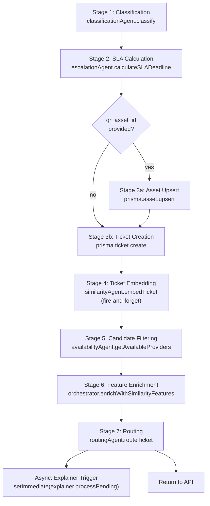
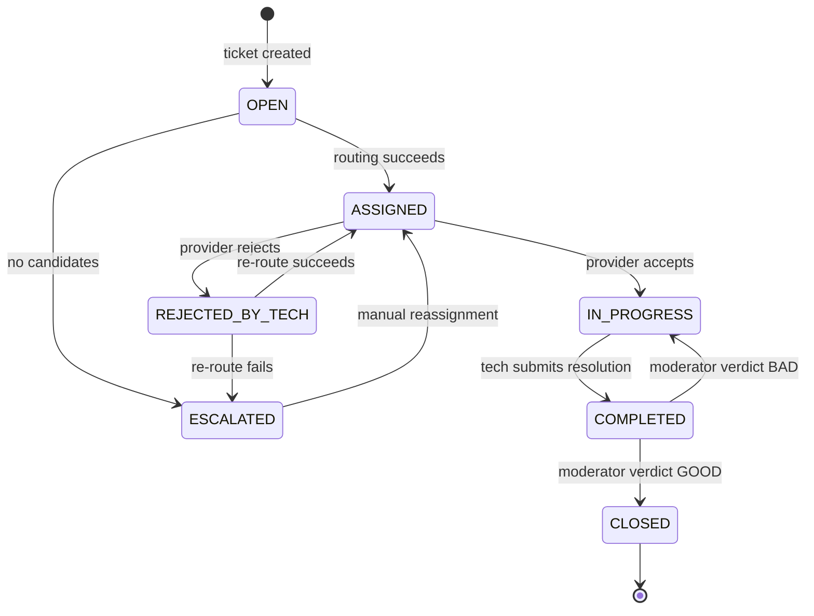
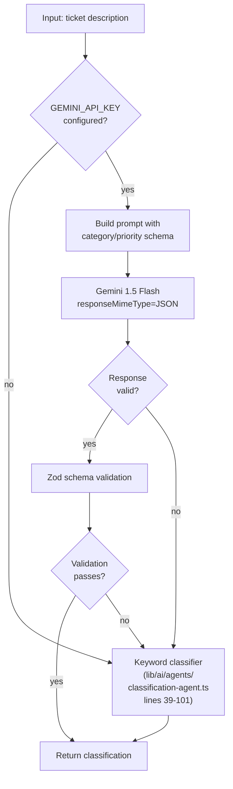
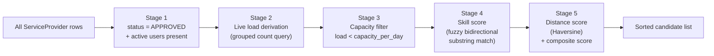
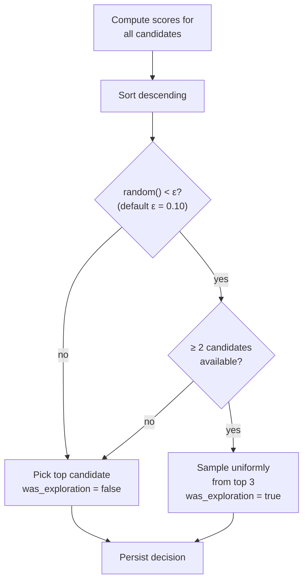
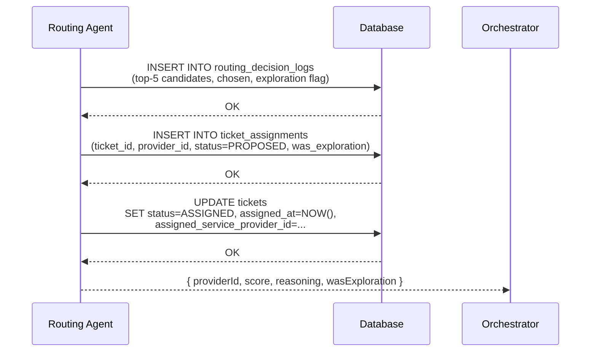
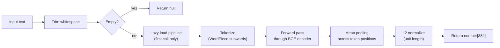
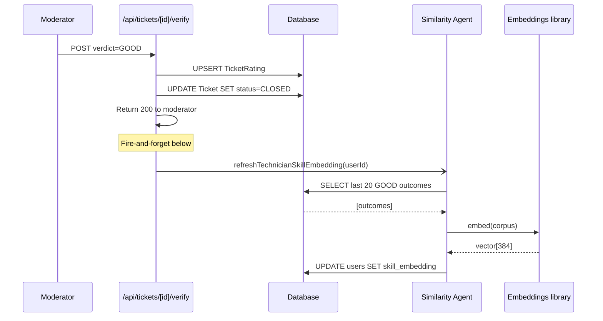
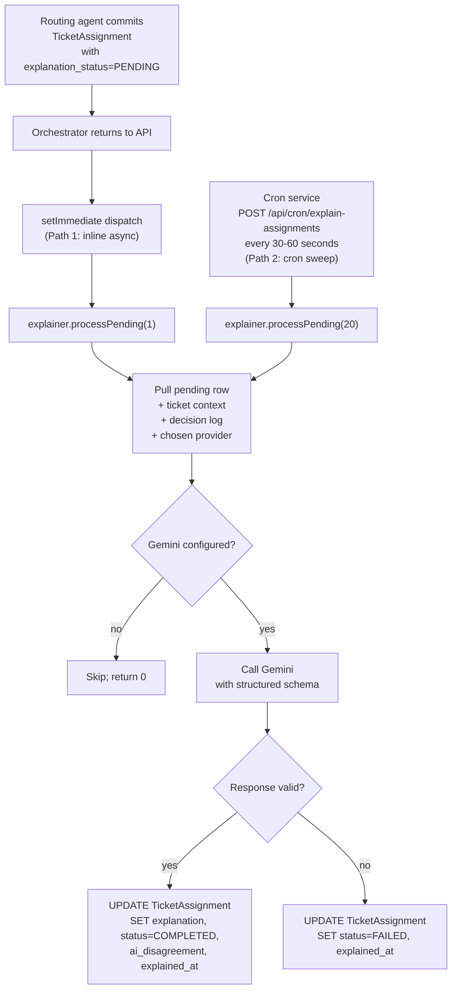
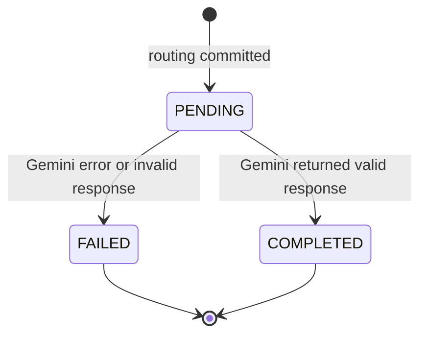

# Chapter 3 — AI Agents and Orchestrator

This chapter presents the implementation of the multi-agent AI core that performs intelligent ticket routing. Whereas Chapter 2 described the agents at the architectural level — what each does and why the system is decomposed this way — this chapter goes one level deeper into the internal mechanics of each agent: their inputs and outputs, the algorithms they implement, the design choices that shaped them, the edge cases they handle, and the failure modes they degrade through.

The chapter is organized around six components: the central orchestrator that composes the pipeline, and five agents — classification, availability, routing, similarity, and explainer. The escalation agent, which predates this work and runs as a periodic batch independent of the routing pipeline, is referenced where relevant but not given a dedicated section.

Throughout the chapter, figures illustrate flow, structure, and state. Inline diagrams use the Mermaid syntax and render in most modern Markdown viewers. Where a more elaborate diagram is required, a detailed description appears under a "Figure" heading; these descriptions are intended to be sufficient input for producing the final figures in a dedicated diagramming tool such as Lucidchart or draw.io.

---

## 3.1 The AI Orchestrator — Central Coordinator

### 3.1.1 Role and Design Philosophy

The `AIOrchestrator` class, defined in `lib/ai/orchestrator.ts`, is the conductor of the multi-agent pipeline. It is the only component in the system that knows the order in which agents must run, the only component that owns the transactional shape of state changes during a ticket's lifecycle, and the only component that holds the cross-agent context (such as the embedding text or the candidate list) as it flows through the pipeline. The agents themselves are deliberately ignorant of one another; each receives plain data inputs and returns plain data outputs, and the orchestrator threads context between them.

This design is sometimes called the conductor pattern. Its principal benefit is that adding, reordering, or replacing a single agent does not affect any other agent — only the orchestrator changes. During the development of this system, the order of operations was revised three times (specifically, the position of the embedding write was moved twice and the position of the explainer trigger was moved once) without requiring any modification to the agents themselves. The cost of the pattern is that the orchestrator file is the densest in the codebase and demands careful reading; this cost was judged acceptable given the value of keeping the agents independently testable.

### 3.1.2 Public Interface

The orchestrator exposes four public methods, each corresponding to one of the four lifecycle events of a ticket: creation, acceptance, rejection, and completion. These methods are the only interface through which the API tier interacts with the orchestrator, and their signatures define the boundary between business logic and AI logic.

```ts
class AIOrchestrator {
  async processNewTicket(data: {
    description: string;
    store_id: string;
    reporter_user_id: string;
    location_in_store: string;
    qr_asset_id?: string;
  }): Promise<{ ticket; classification; assigned; ... }>;

  async handleTicketAcceptance(
    ticketId: string, providerId: string,
    empId: string, phoneNumber: string
  ): Promise<void>;

  async handleTicketRejection(
    ticketId: string, providerId: string, reason: string
  ): Promise<void>;

  async handleTicketCompletion(
    ticketId: string, providerId: string
  ): Promise<void>;
}
```

Of these, `processNewTicket` is by far the most elaborate, sequencing seven distinct stages from classification through asynchronous explanation. The acceptance and completion methods are comparatively thin, primarily updating assignment and ticket statuses. The rejection method is non-trivial because it triggers a re-routing flow that re-invokes the entire candidate-selection pipeline with the rejecting provider filtered out.

### 3.1.3 The Seven-Stage Pipeline

The processing of a new ticket is best understood as a strictly ordered sequence of seven stages, each of which produces an artifact that the subsequent stage consumes. These stages are illustrated in Figure 3.1 and described below.



**Figure 3.1 — The seven-stage processNewTicket pipeline.** The figure shows the strict sequence from classification to routing, including the conditional asset upsert and the fire-and-forget side branches for ticket embedding and asynchronous explanation. The dotted style for stages 4 and the post-routing explainer trigger indicates that these are non-blocking; the main return path runs through the solid arrows.

In Stage 1, the orchestrator invokes the classification agent (Section 3.2) to translate the free-text description into a structured triple. In Stage 2, the escalation agent's `calculateSLADeadline` method consumes the priority field of the classification and returns a wall-clock deadline. In Stage 3, the orchestrator conditionally upserts an `Asset` row keyed on the QR code if one was scanned, and unconditionally creates the `Ticket` row with status `OPEN`. The asset upsert is intentionally placed before the ticket creation so that the foreign-key relationship can be established at insertion time rather than via a subsequent update.

In Stage 4, the orchestrator dispatches a fire-and-forget call to the similarity agent's `embedTicket` method to compute the bge-small embedding of the ticket text and write it back to the `tickets.embedding` column. The orchestrator deliberately does not await this call: the embedding write is an analytics artifact rather than a routing input, and blocking on it would add hundreds of milliseconds to the user-facing latency for no operational benefit.

In Stage 5, the availability agent (Section 3.3) is invoked to produce the candidate list. In Stage 6, the orchestrator's private `enrichWithSimilarityFeatures` helper calls the similarity agent (Section 3.5) twice — once for the technician-fit ranking and once for the asset-history score — and decorates each candidate with two additional feature columns. In Stage 7, the routing agent (Section 3.4) performs the final ranking, executes the exploration mechanism, writes the routing decision log, and creates the assignment.

After Stage 7 returns, the orchestrator schedules the asynchronous explainer agent via `setImmediate` and returns its result to the API layer. The explainer trigger is the final operation of the request path, but it does not block the response: by the time the explainer begins executing, the response has already been serialized and is on its way back to the client.

### 3.1.4 Rejection and Re-Routing

The `handleTicketRejection` method implements the re-routing flow that activates when a service provider rejects a proposed assignment. The method is structured as a smaller version of the main pipeline: it marks the rejected assignment, retrieves the ticket and the store location, fetches a fresh candidate list (which automatically excludes the rejecting provider via live-load constraints if they are now full, and via explicit filtering otherwise), and re-invokes the routing agent on the reduced pool. If the routing agent returns a new assignment, the ticket transitions back to status `ASSIGNED` with an incremented `assignment_sequence`. If the pool is empty, the ticket is set to status `ESCALATED` and a remark is logged for management review.

A subtle but important property of this design is that the rejection itself becomes a learning signal. The original `RoutingDecisionLog` row recorded that this provider was the top pick; the rejection reveals that the heuristic's preference was wrong in this case. When the eventual learned ranker is trained, the rejection event provides an explicit negative label for that decision.

### 3.1.5 Ticket Status State Machine

The orchestrator is responsible for maintaining the consistency of the `Ticket.status` field as it transitions through the lifecycle. Figure 3.2 shows the complete state machine.



**Figure 3.2 — The Ticket status state machine.** The diagram shows all valid transitions in the ticket lifecycle. Each transition corresponds to either an orchestrator method or an API endpoint that ultimately calls the orchestrator. The diagram makes it explicit that a `BAD` moderator verdict reopens the ticket rather than closing it — an intentional design that rejects the legacy notion of "completion equals closure."

The state machine is enforced through a combination of orchestrator code and API-route guards. There is no centralized state-machine library; transitions are encoded directly in the methods that perform them. This decision was made because the state space is small and the transitions are coupled to side effects (assignment writes, embedding refreshes, escalation writes) that benefit from being inline with the transition rather than separated into a generic engine.

---

## 3.2 Classification Agent (LLM-Based)

### 3.2.1 Purpose and Position in the Pipeline

The classification agent, implemented in `lib/ai/agents/classification-agent.ts`, performs the first cognitive task in the routing pipeline: translating an unstructured free-text problem description into a structured triple that downstream agents can consume. Specifically, it produces a category (such as `Facilities`, `IT`, or `Equipment`), a subcategory within that category (such as `Cold Storage`, `POS Systems`, or `Shopping Carts`), and a priority (`HIGH`, `MEDIUM`, or `LOW`). It also returns a confidence value in the range zero to one and a brief reasoning string, both of which are stored alongside the ticket for later analysis.

The classification result feeds three distinct downstream consumers. The escalation agent reads the priority to compute the SLA deadline. The orchestrator reads the category and subcategory to look up the required-skills list via a static mapping table. The routing agent reads the priority a second time to apply weight adjustments to its scoring formula. Because three components depend on the classification, an absent or malformed classification would block the entire pipeline; the agent is therefore designed to never fail to produce a result, even at the cost of producing an imperfect one.

### 3.2.2 Internal Structure

The agent has two execution paths: a primary path using Google's Gemini 1.5 Flash language model, and a fallback path using a keyword-based deterministic classifier. The selection between paths is not a runtime decision based on input — it is a hard fallback triggered only when the primary path fails. Figure 3.3 illustrates the decision logic.



**Figure 3.3 — Classification agent execution paths.** The diagram shows the primary LLM path with two failure points (network error or invalid response, schema validation failure) and the deterministic keyword fallback. Both paths converge on the same output type, ensuring that the orchestrator never needs to reason about which path produced the result.

### 3.2.3 The LLM Path

When `GEMINI_API_KEY` is configured, the agent constructs a Gemini model instance with two important configuration parameters: `model: 'gemini-1.5-flash'` for cost efficiency, and `responseMimeType: 'application/json'` accompanied by a strict response schema. The response schema is declared using the SDK's `SchemaType` enumeration and constrains the model's output to a JSON object containing exactly the four required fields. This schema-constrained generation is a feature of recent Gemini models and effectively eliminates the class of failures in which the model returns prose around the JSON, returns malformed JSON, or omits a required field.

The prompt itself is constructed in the agent's private `buildPrompt` method. It includes a brief role declaration, the category and subcategory definitions, a short priority rubric, and the ticket description. The agent does not include any few-shot examples in the prompt; the structured-output schema and the model's instruction-following capabilities have proven sufficient for the task. The prompt is approximately three hundred tokens, and the response is bounded by the schema to under one hundred tokens, yielding a per-call cost of approximately one one-hundredth of a US cent at current Gemini pricing.

After the model returns, the agent runs the parsed JSON through a Zod schema validation step. The Zod schema is declared at module scope and mirrors the response-schema constraints, providing a second line of defense against any output that bypasses the model's own schema constraints. Validation failures cause an immediate fallback to the keyword classifier.

### 3.2.4 The Keyword Fallback

The fallback classifier is a hand-written deterministic function that examines the ticket description for predefined keyword patterns and assigns reasonable defaults based on the patterns found. The mapping is intentionally simple: descriptions containing words such as "freezer" or "cooling" classify to `Facilities/Cold Storage/HIGH`, descriptions containing "POS" or "checkout" to `IT/POS Systems/HIGH`, descriptions containing "cart" or "shelf" to `Equipment/Shopping Carts/LOW` or `Equipment/Shelving/LOW`, and descriptions matching no specific pattern to `General/Maintenance/MEDIUM`. The fallback always returns a confidence value of 0.5, signaling to downstream consumers that the classification is heuristic.

The purpose of the fallback is operational continuity. If Gemini's API is unavailable, slow, or returning errors, the classification agent must still produce a result so that the orchestrator can proceed. The cost of an imperfect classification is significantly lower than the cost of a failed ticket creation, which would block the store register from registering a maintenance request. This degrade-don't-die principle is applied uniformly across all agents in the system; the classification agent is its earliest and most visible example.

### 3.2.5 The Skill Mapping Table

The classification agent's output drives skill selection through a static mapping table maintained in the orchestrator's `getRequiredSkills` method. The table associates each `(category, subcategory)` pair with a list of relevant skill names. For example, `Facilities/Cold Storage` maps to `['Refrigeration', 'HVAC']`, `IT/POS Systems` maps to `['POS Systems', 'IT Support']`, and the catch-all `General/Maintenance` maps to `['General Maintenance']`. The output of this table becomes the input to the availability agent's skill-match scoring.

The skill mapping is intentionally maintained as code rather than as a database table, for two reasons. First, the set of categories and the set of skills are tightly coupled: changes to either typically require corresponding changes to the other, and storing them in code keeps the coupling visible during code review. Second, the skill mapping is consulted inside a hot code path; an in-memory lookup is materially faster than a database fetch.

**Figure 3.4 — The category-to-skills mapping table** *(to be rendered as a two-column table figure)*. The figure should show a two-column table listing all ten `(category, subcategory)` combinations on the left and their corresponding skill arrays on the right. The table demonstrates the discrete domain of skills used by the system and provides reviewers with a complete view of what the classification agent's output controls.

---

## 3.3 Availability Agent (Filtering and Load Tracking)

### 3.3.1 Purpose and Position in the Pipeline

The availability agent, implemented in `lib/ai/agents/availability-agent.ts`, is the second stage of the AI core's processing of a new ticket. Its role is to produce a candidate list — a set of service providers that have the capacity, geographic plausibility, and at least nominal skill relevance to take the ticket. It is intentionally a coarse filter rather than a final ranker: the routing agent applies the strict ranking later in the pipeline, while the availability agent's job is to ensure that the routing agent does not waste effort scoring providers who cannot possibly take the work.

The agent operates as a multi-stage pipeline of its own, transforming the full set of approved providers through a series of filters and annotations into a sorted candidate list with a composite quality score on each entry.

### 3.3.2 The Five-Stage Internal Pipeline

The agent's `getAvailableProviders` method executes five distinct stages, each producing a strict subset of the previous stage's output along with additional annotations. Figure 3.5 illustrates the pipeline.



**Figure 3.5 — The availability agent's five-stage pipeline.** Each stage is a narrowing or annotating transformation. Stages 1 and 3 are filters; stages 2, 4, and 5 are annotations that add fields to the surviving rows. The output is a list sorted descending by composite score.

In Stage 1, the agent issues a Prisma query against the `ServiceProvider` table, filtering by `status = 'APPROVED'` and including the related `users` filtered by `role = 'SERVICE_PROVIDER'` and `is_active = true`. The result is the universe of providers eligible for any kind of assignment. Providers without any active users are dropped immediately, since there is no one to receive the work.

### 3.3.3 Live Load Derivation — A Critical Design Choice

Stage 2 is the most architecturally significant operation in the agent. Rather than reading the `current_load` integer column on the `ServiceProvider` table — which had been the design in the legacy system — the agent issues a single grouped count query against the `TicketAssignment` table:

```ts
const liveLoadRows = await prisma.ticketAssignment.groupBy({
  by: ['service_provider_id'],
  where: {
    service_provider_id: { in: providerIds },
    status: { in: ['PROPOSED', 'ACCEPTED'] }
  },
  _count: { _all: true }
});
```

The result is a map from `service_provider_id` to the count of currently active assignments for that provider. This count is then used as the live load for the capacity check in Stage 3 and for the availability score in Stage 5.

The motivation for this design is the avoidance of a class of bugs that had silently corrupted the legacy system. In the previous design, the `ServiceProvider.current_load` column was incremented and decremented from three different code paths: the routing agent incremented it when an assignment was committed, the orchestrator decremented it when a rejection was handled, and the orchestrator decremented it again when a completion was handled. None of these mutations were transactionally bound to the assignment writes that ostensibly justified them. Any failure in the application code or any code path that wrote to one without the other would leave the counter inconsistent, and the corruption would persist indefinitely because nothing else recomputed it.

The grouped-count query has none of these failure modes. It is correct by construction: the count it returns is exactly the number of active assignment rows in the database at the moment the query runs. If a row is added, it appears in the count; if a row's status changes, it is excluded. The price of this correctness is one additional database round-trip per ticket creation, which is well within the available latency budget. The price of the previous design was unbounded silent drift.

**Figure 3.6 — Comparison of legacy counter-mutation design and current derived-query design** *(to be rendered as a two-panel diagram)*. The left panel shows the legacy design with three arrows from the routing agent, the rejection handler, and the completion handler, each writing to the `current_load` column with no synchronization. The right panel shows the current design with one arrow from the availability agent issuing a `GROUP BY` query to the `TicketAssignment` table. A caption emphasises that the new design eliminates a class of correctness bugs without requiring locking or coordination.

### 3.3.4 The Capacity Filter

Stage 3 applies the capacity filter: providers whose live load equals or exceeds their `capacity_per_day` are dropped from the pool. This is the only hard filter in the agent — all subsequent operations are annotations that affect score but do not eliminate candidates. The decision to retain providers with weak skill matches and large geographic distances reflects an operational reality: the application sometimes operates in regions where the candidate pool is small, and an over-aggressive filter at this stage would frequently leave the system with no candidates at all.

### 3.3.5 The Skill-Match Score

Stage 4 computes a skill-match score for each surviving candidate. The score is the fraction of required skills that have at least one match in the candidate's skill array, where a match is defined by bidirectional substring containment, case-insensitively. That is, a required skill `"Refrigeration"` matches a candidate skill `"Industrial Refrigeration Systems"` because the required skill is contained in the candidate skill, and a required skill `"HVAC"` matches a candidate skill `"H"` would be a near-miss but only if pure prefix matching were used; here, the bidirectional containment requires that one of the two strings fully contains the other, which avoids that false positive.

This fuzzy matching is intentionally permissive. In real operational data, the formal skill names in the category map rarely match the free-form skill labels that providers enter into their profiles, and an exact-match policy would systematically zero out candidates who in fact have the relevant skill but expressed it slightly differently. The trade-off is that the score is occasionally generous to candidates who are not truly qualified; the routing agent's later weighting is responsible for handling that downstream.

### 3.3.6 Distance and Composite Scoring

Stage 5 computes the geographic distance from the store to each candidate's primary location using the Haversine formula. The formula treats Earth as a sphere of radius 6371 kilometres and produces a great-circle distance accurate to within a fraction of a percent for the distances involved (typically tens of kilometres). The agent then computes a normalized distance score as `max(0, 1 - distance / 100km)`, mapping distances of up to one hundred kilometres into the unit interval.

The composite overall score combines availability, distance, and skill match with hand-tuned weights:

```
overallScore = 0.4 × availabilityScore
             + 0.3 × distanceScore
             + 0.3 × skillMatchScore
```

The weights at this stage are intentionally not the same as those in the routing agent, which uses a six-feature score with different weights and priority adjustments. The availability agent's score is a coarse pre-ranking used to order the list returned to the orchestrator; the routing agent will re-score the same candidates with its more elaborate formula.

The candidate list is finally sorted descending by overall score and returned. Logging output captures the full ranking with per-candidate scores and skill lists, which has proven valuable during debugging when routing decisions are being audited.

---

## 3.4 Routing Agent (Six-Feature Scoring Engine)

### 3.4.1 Purpose and Position in the Pipeline

The routing agent, implemented in `lib/ai/agents/routing-agent.ts`, is the final and most consequential stage of the request-path pipeline. Its inputs are the enriched candidate list produced by the orchestrator (containing the availability agent's coarse ranking augmented by the similarity agent's two semantic features) and the ticket's classification, priority, and store location. Its output is a single chosen candidate, a counterfactual log of the considered alternatives, and a persisted assignment row.

The agent is the only component in the system that performs the act of assignment. All routing logic, all priority-driven adjustments, all exploration decisions, and all persistence operations associated with the assignment are contained within this agent's `routeTicket` method. Centralising this logic in a single method ensures that every assignment in the system is the product of a uniform process, which is essential for the integrity of the counterfactual training data.

### 3.4.2 The Six-Feature Score

The agent's central computation is a weighted sum of six features. Each feature is normalized to the unit interval, and the weights are constrained to sum to one, so the resulting score is itself a unit-interval value directly comparable across candidates and across time. The feature set is shown in Table 3.1.

| Feature | Default Weight | Source | Cold-Start Default |
|---|---|---|---|
| Skill Match | 0.30 | Per-skill weighted match against the category-skills table | Computed |
| Proximity | 0.20 | Haversine distance, normalized to a fifty-kilometre maximum | Computed |
| Availability | 0.15 | `1 − live_load / capacity_per_day` | Computed |
| Semantic Similarity | 0.15 | Cosine similarity of ticket embedding to candidate's skill embedding | 0 |
| Asset History | 0.10 | Fraction of GOOD verdicts on past tickets for this asset | 0 |
| Performance | 0.10 | Historical fraction of completed tickets | 0.5 (new providers) |

**Table 3.1 — The six-feature scoring formula.** The "Cold-Start Default" column indicates the value the feature takes when the underlying data is unavailable. Two of the six features default to zero, reflecting the system's graceful-degradation behaviour during the data-accumulation phases of the rollout.

The skill-match feature differs from the equivalent feature in the availability agent in one important respect: the routing agent uses a per-skill weighted match rather than a uniform fraction. Specifically, for each `(category, subcategory)` combination, a private `getCategorySkills` method returns a list of `(skill, weight)` tuples — for example, `Facilities/Cold Storage` returns `[('Refrigeration', 0.8), ('HVAC', 0.6), ('Electrical', 0.4)]`. The routing agent's score is the sum of weights for skills that match, divided by the sum of all weights. This weighted match captures the intuition that some skills matter more than others for a given category: a refrigeration specialist is more relevant to a cold-storage failure than an electrician, even though both might be present in a candidate's skill list.

### 3.4.3 Priority-Driven Weight Adjustment

The default weights in Table 3.1 are applied to `MEDIUM` and `LOW` priority tickets. For `HIGH` priority tickets, the weights are adjusted to reflect the operational reality that an urgent ticket benefits more from fast arrival than from sophisticated matching. Specifically, the `proximity` and `availability` weights each increase by ten percentage points, the `skill_match` weight decreases by five points, the `semantic_similarity` weight decreases by ten points, and the `asset_history` weight decreases by five points. The total still sums to one, preserving the comparability of scores across priority levels.

The adjustment is rooted in a specific operational thesis: when a freezer in a grocery store fails on a Saturday afternoon, the cost of waiting an extra hour for a perfectly-matched specialist is significantly higher than the cost of dispatching a competent generalist who happens to be ten minutes away. The numerical adjustments quantify this thesis in a way that operators can inspect and adjust over time as the system accumulates outcome data.

### 3.4.4 The Exploration Mechanism

Before selecting a candidate, the routing agent applies an ε-greedy exploration policy. With probability `ROUTING_EXPLORATION_RATE` (defaulting to 0.10 and configurable via environment variable), the agent samples uniformly from the top three candidates rather than strictly selecting the top-scored candidate. The chosen assignment is annotated with `was_exploration = true` so that downstream training and analysis can account for the perturbation. Figure 3.7 illustrates the decision logic.



**Figure 3.7 — The ε-greedy exploration decision logic.** The diagram shows the two-step decision: first a Bernoulli trial against the exploration rate, and conditionally a uniform sample over the top three candidates. The result of the decision is recorded on the assignment row, allowing post-hoc analysis of exploration effects.

The motivation for the exploration mechanism is fundamental to the system's long-term learning ability. A purely greedy policy — one that always selects the top-scored candidate — produces training data that is biased toward the policy's existing preferences. When such data is used to train a learned ranker, the model converges on the policy that produced its training data, rather than learning anything that would distinguish good outcomes from bad. This phenomenon is known as selection-bias poisoning and is a well-documented failure mode in production recommender systems. Exploration injects controlled variance into the policy's decisions, ensuring that the eventual learned ranker has access to outcome data for candidates the policy might otherwise never have selected.

The exploration rate of ten percent reflects a balance: high enough to produce statistically meaningful counterfactual data within a reasonable time, low enough that the operational cost of occasionally dispatching a slightly worse candidate is acceptable. The value can be tuned without code changes via the environment variable, and the routing decision log allows post-hoc analysis of the actual cost in terms of outcome-quality difference between exploration and exploitation choices.

### 3.4.5 Counterfactual Decision Logging

Before writing the assignment row, the routing agent persists a `RoutingDecisionLog` row that captures the top five candidates with their full feature breakdowns, the chosen candidate's identifier, and the exploration flag. This log is the unit of training data for the eventual learned ranker. Each log row corresponds to one routing decision and contains enough information to reconstruct the feature vector for each considered candidate, even though only the chosen candidate's outcome will be observed.

The choice to persist the top five rather than all candidates is a storage-cost trade-off. In typical operation the candidate list contains between five and twenty providers; storing the full list would multiply the log table's size without proportional analytical benefit, since candidates beyond the top five are rarely competitive. The cap at five also bounds the per-row JSON column size, which keeps queries against the log table efficient.

### 3.4.6 Persistence Sequence

The routing agent's persistence sequence is strictly ordered to ensure that the database state is always consistent. Figure 3.8 shows the sequence.



**Figure 3.8 — The routing agent's persistence sequence.** The agent writes three rows in strict order: first the decision log, then the assignment row, then the ticket-status update. The order is significant: the decision log is the analytical artifact and is written first so that even if a subsequent step fails, the decision is not lost; the assignment row is the operational artifact and is written before the ticket-status update because the assignment is the source of truth for ownership and the ticket-status update is a denormalized cache for legacy readers.

A subtle but deliberate property of this sequence is that the `Ticket.assigned_service_provider_id` column — which Chapter 2 described as a denormalized cache rather than the source of truth — is updated last. The authoritative source of ownership is the active `TicketAssignment` row, which is created in step two; the cache update in step three is redundant but maintained for legacy read sites that have not yet been migrated. Should the cache update fail, the system remains functionally correct: every read site that has been migrated through `getTicketContext` will continue to find the correct ownership through the `TicketAssignment` row.

### 3.4.7 Removed Legacy Code

The redesign removed two significant pieces of legacy code from the routing agent. The first was a dead Gemini SDK initialization block that instantiated a `GoogleGenerativeAI` instance in the constructor but was never called by any method in the agent. The block existed presumably as the start of an aborted attempt to introduce LLM-aided routing; its retention as inert code was a debugging tax on every contributor who needed to reason about whether the LLM was actually being used. The second was the manual `ServiceProvider.current_load` increment that the agent performed on every successful assignment. As discussed in Section 3.3.3, this counter mutation was eliminated when the availability agent shifted to deriving the load from the `TicketAssignment` table.

---

## 3.5 Similarity Agent (Semantic Search and Embeddings)

### 3.5.1 Purpose and Position in the Pipeline

The similarity agent, implemented in `lib/ai/agents/similarity-agent.ts`, is the system's interface to vector search. It exposes three responsibilities, all of which involve reading or writing 384-dimensional embedding vectors stored in `pgvector` columns: ranking technicians by semantic fit to a ticket, computing the asset-history score for each candidate, and refreshing a technician's skill embedding after a successful resolution.

The agent is invoked at two distinct points in the system. During ticket creation, the orchestrator's `enrichWithSimilarityFeatures` helper calls the agent twice — once for technician ranking and once for asset history — to decorate the candidate list with semantic features. After moderator verification, the verify endpoint invokes the agent's `refreshTechnicianSkillEmbedding` method as a fire-and-forget side effect when a `GOOD` verdict is recorded.

### 3.5.2 The Embedding Pipeline

The agent's embedding computation is performed by the `embed` function in `lib/ai/embeddings.ts`. This function lazily initializes a feature-extraction pipeline based on the `bge-small-en-v1.5` model, downloads and caches the model weights on first use (approximately thirty megabytes), and produces 384-dimensional unit-normalized vectors from input text. Figure 3.9 illustrates the pipeline.



**Figure 3.9 — The embedding generation pipeline.** Input text passes through trimming, lazy model loading, tokenization, encoding, pooling, and normalization. The pipeline runs entirely in-process with no network I/O once the model is loaded. The unit-normalization step ensures that cosine similarity reduces to a simple dot product, which is what `pgvector` computes internally.

The decision to run embeddings locally rather than via a remote API is one of the most consequential design choices in the system. The driving consideration is privacy: ticket descriptions can contain personally identifying information such as customer names, employee names, and store-specific operational details. Sending such text to a third-party embedding API would constitute a data-residency story that the application cannot defend. A secondary consideration is latency: a local embedding takes approximately thirty milliseconds once the model is warm, compared to two hundred milliseconds or more for a remote API call. A tertiary consideration is replaceability: the model is open-weight, so future migrations to a different bge variant or to a competing open model are possible without contractual constraints.

The choice of `bge-small-en-v1.5` specifically reflects a balance between quality and cost. Larger models such as `bge-base` or `bge-large` would produce slightly higher retrieval quality but require several hundred megabytes of memory and proportionally more CPU. The small variant is competitive with much larger models on the MTEB retrieval benchmark for short technical text, which is the dominant use case in this system, and its memory footprint is small enough to coexist with the Next.js runtime in a single process.

### 3.5.3 Technician Ranking by Semantic Fit

The agent's `rankTechniciansByFit` method takes a ticket-text input and returns a ranked list of technicians by cosine similarity to their accumulated skill embedding. The query is implemented as a raw SQL query because Prisma's typed query API does not yet support the `pgvector` distance operator. The query is shown below in slightly simplified form:

```sql
SELECT id, associated_provider_id,
       1 - (skill_embedding <=> $1::vector) AS similarity
FROM users
WHERE skill_embedding IS NOT NULL
  AND role IN ('SERVICE_PROVIDER', 'TECHNICIAN')
  AND is_active = true
ORDER BY skill_embedding <=> $1::vector
LIMIT $2;
```

The `<=>` operator is `pgvector`'s cosine-distance operator, returning a value in the closed interval `[0, 2]` (because cosine similarity is in `[−1, 1]`). For unit-normalized vectors, distance is `1 − similarity`, so the expression `1 - (skill_embedding <=> $1::vector)` recovers the similarity directly. The query is backed by the HNSW index on `users.skill_embedding`, which provides logarithmic-complexity approximate nearest-neighbour search and remains efficient even at hundreds of thousands of indexed vectors.

The orchestrator's enrichment helper consumes this ranked list in two steps. First, it groups the returned users by their `associated_provider_id`, treating each technician's similarity as evidence about the provider as a whole. Second, it takes the maximum similarity across the technicians belonging to each candidate provider as the provider's `semantic_similarity` feature value. The motivation for taking the maximum rather than the average is that a single highly-relevant technician at a company is sufficient justification for routing the ticket to that company; less-relevant technicians at the same company should not dilute the signal.

### 3.5.4 Asset-History Scoring

The agent's `assetHistoryByCandidate` method computes a per-candidate score reflecting their historical success on tickets involving the same physical asset or the same asset model. The method accepts an `asset_id`, a list of candidate provider IDs, and an optional list of candidate user IDs, and returns a map from candidate identifier to a structure containing the count of past good outcomes, the count of total past outcomes, and the ratio of the two.

The method first looks up the asset's `make` and `model` fields. If both are populated, the method extends the search to all assets sharing the same make and model — a "fleet match" that captures the operational reality that experience with one freezer of a given model transfers to other freezers of the same model. If the make or model is unset, the search is restricted to the specific asset.

The score then aggregates over the past `TicketAssignment` rows for tickets on any matching asset, joining to the `TicketRating` table to determine the outcome. A `GOOD` verdict on the rating is treated as a positive outcome; a `BAD` verdict or the absence of a rating is treated as a negative outcome. The fraction of positive outcomes becomes the candidate's `asset_history_good_ratio` feature.

**Figure 3.10 — The asset-history aggregation flow** *(to be rendered as a join diagram)*. The figure should show the join path from a starting asset through the fleet-match expansion (same make and model), through the `tickets` table, through the `ticket_assignments` and `ticket_ratings` tables, terminating at the per-candidate good-ratio aggregate. The diagram should make explicit that the join requires both an outcome submission and a moderator verification to be useful, and that until both have accumulated, the score defaults to zero.

The score has obvious cold-start limitations: until tickets have been verified for assets in the system, the score is uniformly zero across all candidates and contributes nothing to routing decisions. This is consistent with the system's broader graceful-degradation principle: features that lack data simply do not contribute to scores until they do.

### 3.5.5 Skill Embedding Refresh

The third responsibility of the similarity agent is the refresh of a technician's skill embedding after a successful resolution. The `refreshTechnicianSkillEmbedding` method is invoked by the verify endpoint (and only by the verify endpoint) when a moderator submits a `GOOD` verdict. The method retrieves the resolving technician's last twenty positively-verified outcomes, concatenates the `root_cause` and `technician_notes` text fields from each, embeds the resulting corpus, and writes the embedding to the `users.skill_embedding` column.

Figure 3.11 illustrates the refresh trigger and data flow.



**Figure 3.11 — The skill-embedding refresh trigger.** The figure shows the verify endpoint returning to the moderator immediately after persisting the rating and ticket-status update, with the embedding refresh occurring as a fire-and-forget side effect. The dashed call from the API to the agent indicates the non-blocking dispatch.

The decision to recompute the entire embedding from the last twenty outcomes, rather than incrementally update an existing embedding, reflects a deliberate trade-off. Incremental updates would be cheaper but would require maintaining additional state (the running mean of past contributions) and would compound numerical error over many updates. A fresh full computation costs approximately half a second of CPU per technician, which is acceptable as a fire-and-forget operation triggered only by verification events. The lookback window of twenty outcomes balances staleness (older outcomes are less reflective of current skills) against statistical stability (a single recent outcome should not drastically change the embedding).

### 3.5.6 Cold-Start Behaviour

The similarity agent's three responsibilities exhibit different cold-start behaviours. Technician ranking returns an empty list when no users have a non-null `skill_embedding`, which causes the orchestrator's enrichment helper to set the `semantic_similarity` feature to zero for every candidate. Asset-history scoring returns an empty map when no past tickets on matching assets have been verified, similarly causing `asset_history_good_ratio` to default to zero. The skill-embedding refresh is simply never triggered until verifications begin to occur.

The system is therefore fully operational on day one despite the absence of any training data, with the routing agent's deterministic features (skill match, proximity, availability, performance) carrying the full weight of the decision. As outcomes accumulate, the semantic features begin to contribute, and the routing decisions shift smoothly from purely deterministic to learning-augmented without any manual cutover.

---

## 3.6 Explainer Agent (Async LLM Rationale)

### 3.6.1 Purpose and Position in the Pipeline

The explainer agent, implemented in `lib/ai/agents/explainer-agent.ts`, occupies an unusual position in the system: it is the only agent that does not run on the request path. Its purpose is to produce a human-readable rationale for every routing decision and to flag any decisions where the heuristic appears to have made a poor choice, but it does so asynchronously, after the user has already received their response. The rationale is written to the `TicketAssignment.explanation` column and surfaced in administrative dashboards as an audit trail; the disagreement flag is written to `TicketAssignment.ai_disagreement` and surfaced as a review prompt for moderators.

The agent's design is shaped by a single principle: the user-facing latency of ticket creation must not depend on the availability of a language model. The classification agent, which also uses Gemini, sits on the request path because its output is required for the routing decision itself. The explainer agent's output, in contrast, is purely an audit artifact; placing it on the request path would have added five to fifteen seconds of latency to every ticket creation with no operational benefit, and an outage of the language-model provider would have prevented any ticket from being assigned. The asynchronous design preserves both properties: assignments happen immediately, and explanations queue up to be processed when service is available.

### 3.6.2 Trigger Paths

The agent has two distinct triggers, each of which calls the same `processPending` method on a different cadence. Figure 3.12 illustrates the two paths.



**Figure 3.12 — The explainer agent's two trigger paths.** Path 1 is the inline `setImmediate` dispatch from the orchestrator after every successful routing decision; Path 2 is the cron sweep that catches any assignments left in `PENDING` state. Both paths converge on the same `processPending` method, which dequeues a batch of pending rows and processes them sequentially.

The first trigger path is the orchestrator's `setImmediate` dispatch immediately after the routing agent commits the assignment. This dispatch is fire-and-forget: the orchestrator does not await its completion and does not surface its result to the API response. In normal operation, the explainer begins processing within a few milliseconds of the API response being sent, and the explanation typically appears on the assignment row within five to ten seconds.

The second trigger path is a cron-callable endpoint at `/api/cron/explain-assignments`, designed to be invoked every thirty to sixty seconds by an external scheduler such as Vercel Cron or a GitHub Actions workflow. The endpoint is protected by a shared-secret header (`X-Cron-Secret`) and processes a configurable batch of pending rows on each invocation. The cron path exists to recover from any failures of the inline path: if the orchestrator's process crashes between the assignment write and the `setImmediate` dispatch, or if the inline call to Gemini fails, the assignment remains in `PENDING` state and is picked up by the next cron sweep.

### 3.6.3 The Structured-Output Prompt

The agent's interaction with Gemini uses the same structured-output pattern as the classification agent. The response schema declares four fields: an `appropriate` boolean indicating whether the heuristic's pick is reasonable, a `confidence` value in the unit interval, a `rationale` string of two to four sentences, and an optional `concerns` array of specific concerns to be raised when `appropriate` is false. The prompt is constructed in the agent's private `buildPrompt` method and includes the ticket description, the classification, the priority, the asset metadata if available, the chosen provider's name and skills, and the top five candidates' identifiers, scores, and feature breakdowns from the decision log.

The prompt is intentionally written in an audit-style register: the model is instructed to evaluate whether the routing was appropriate and to flag specific concerns rather than simply describe the decision. This phrasing produces explanations that are useful as audit trails — they describe the reasoning behind the choice and identify weaknesses — rather than pure post-hoc rationalizations that simply restate the choice in prose.

### 3.6.4 The Disagreement Flag

The `ai_disagreement` flag on the assignment row is set to `true` only when the model returns `appropriate = false` with confidence above 0.6. The threshold is intentionally conservative: language-model confidence values are not calibrated probabilities, and treating a `confidence = 0.55` disagreement as a high-priority signal would generate too many false positives to be useful. The 0.6 threshold has produced disagreement rates in development of approximately five percent of assignments, which is operationally tolerable for moderator review.

The flag is surfaced in administrative dashboards but does not trigger automatic re-routing. The decision to leave action in human hands reflects a principle: an unreliable signal — and the model's confidence value is by no means a reliable probability — should inform human decisions, not make automated ones. A future evolution of the system could introduce a feedback loop in which moderator overrides of disagreement-flagged assignments produce labeled training data for either the language-model agent itself (via fine-tuning) or for the routing agent (as additional negative-outcome rows). At present, however, the flag is purely an audit prompt.

### 3.6.5 The Explanation State Machine

The `TicketAssignment.explanation_status` column tracks the lifecycle of the explanation as a small state machine, illustrated in Figure 3.13.



**Figure 3.13 — The explanation status state machine.** The state machine has only three states: `PENDING` on assignment creation, `COMPLETED` when Gemini returns a valid structured response, and `FAILED` when Gemini errors or returns an invalid response. There is no automatic retry from `FAILED` to `PENDING`; failed explanations remain failed unless an operator manually requeues them.

The decision not to automatically retry failed explanations reflects a cost-control principle: a Gemini outage that causes mass failures should not produce a thundering retry storm when service is restored, and a malformed response from the model is unlikely to become well-formed on a retry without intervention. Operators can manually requeue failed rows by updating their status back to `PENDING`, but this is a deliberate human action.

### 3.6.6 Failure Modes and Graceful Degradation

The explainer agent has three principal failure modes, each of which is handled without affecting the rest of the system. If `GEMINI_API_KEY` is unset, the agent returns immediately from `processPending` and logs a warning; assignments remain in `PENDING` state but are otherwise normal. If a Gemini call fails (network error, rate limit, model error), the per-row failure is caught and the row is marked `FAILED`; subsequent rows in the batch continue to be processed. If a Gemini response is structurally valid but Zod schema validation fails (an unusual case given the structured-output schema), the row is marked `FAILED`.

In all cases, the assignment itself is unaffected: the user has received their response, the routing agent has committed the decision, and the only consequence of explainer failure is the absence of the audit text. This isolation is the key property that allows the agent to use a language model freely without compromising the system's reliability.

---

## Summary

This chapter has traced the implementation of the AI core through six components: a central orchestrator that conducts the pipeline, an LLM-backed classification agent that produces structured output from free text, a deterministic availability agent that filters and ranks the candidate pool, a six-feature routing agent that makes the assignment decision with controlled exploration, a vector-search similarity agent that contributes semantic and asset-history features, and an asynchronous explainer agent that produces audit-trail rationales without coupling user-facing latency to language-model availability.

The components are bound together by three architectural principles. First, the request path uses language models only where their output is structurally required (classification), and uses deterministic code for everything else (availability, routing); language-model use that is valuable but not load-bearing (explanation) is moved off the request path entirely. Second, every agent degrades gracefully under the absence of its primary inputs — the classifier falls back to keyword matching, the similarity agent returns zero scores when embeddings are absent, the explainer leaves rationales blank during outages — so the system as a whole continues to function correctly even when individual components fail. Third, every routing decision is logged in full counterfactual detail before the assignment is committed, ensuring that the system's eventual learned ranker can train on the policy's actual decisions plus the alternatives it considered, rather than only the decisions it ultimately made.

These principles are not unique to this system, but their consistent application across all six components is what makes the system robust enough to deploy on day one and structured enough to learn over time.

---

## Figures Summary

The following figures appear in this chapter. Figures rendered inline as Mermaid diagrams will display in any modern Markdown viewer; figures marked as descriptive callouts should be produced in a dedicated diagramming tool for the final report.

| # | Title | Type | Source |
|---|---|---|---|
| 3.1 | The seven-stage processNewTicket pipeline | Mermaid flowchart | inline |
| 3.2 | The Ticket status state machine | Mermaid state diagram | inline |
| 3.3 | Classification agent execution paths | Mermaid flowchart | inline |
| 3.4 | The category-to-skills mapping table | Two-column table figure | descriptive callout |
| 3.5 | The availability agent's five-stage pipeline | Mermaid flowchart | inline |
| 3.6 | Comparison of legacy counter-mutation design and current derived-query design | Two-panel architecture diagram | descriptive callout |
| 3.7 | The ε-greedy exploration decision logic | Mermaid flowchart | inline |
| 3.8 | The routing agent's persistence sequence | Mermaid sequence diagram | inline |
| 3.9 | The embedding generation pipeline | Mermaid flowchart | inline |
| 3.10 | The asset-history aggregation flow | Join diagram | descriptive callout |
| 3.11 | The skill-embedding refresh trigger | Mermaid sequence diagram | inline |
| 3.12 | The explainer agent's two trigger paths | Mermaid flowchart | inline |
| 3.13 | The explanation status state machine | Mermaid state diagram | inline |

For the descriptive-callout figures (3.4, 3.6, 3.10), the relevant section of this chapter contains a paragraph beginning "The figure should show…" describing what the figure must contain. These descriptions are sufficient input for a designer using draw.io, Lucidchart, or a similar tool to produce the final figure for the printed report.
