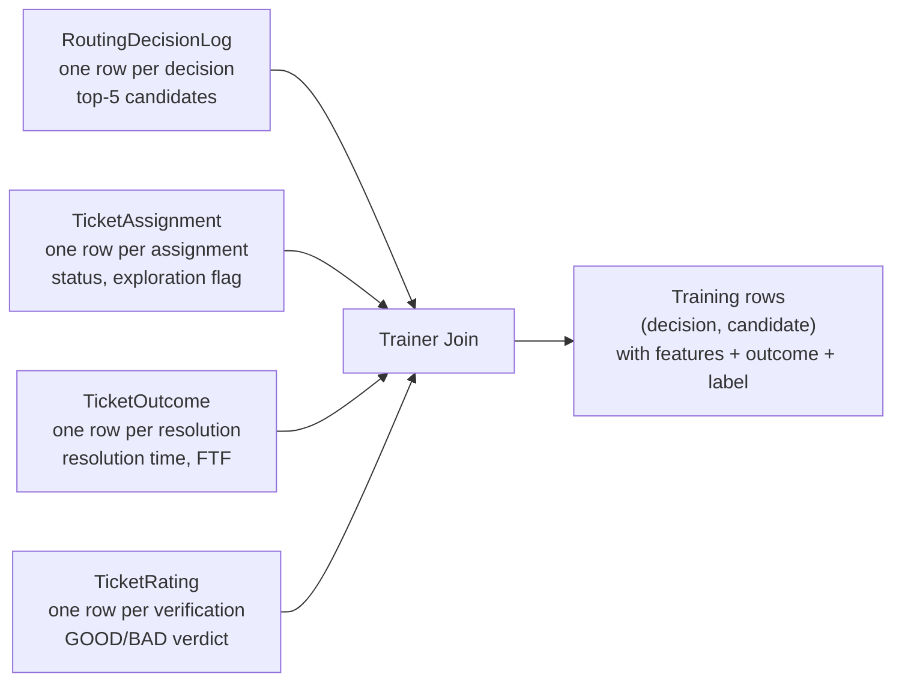
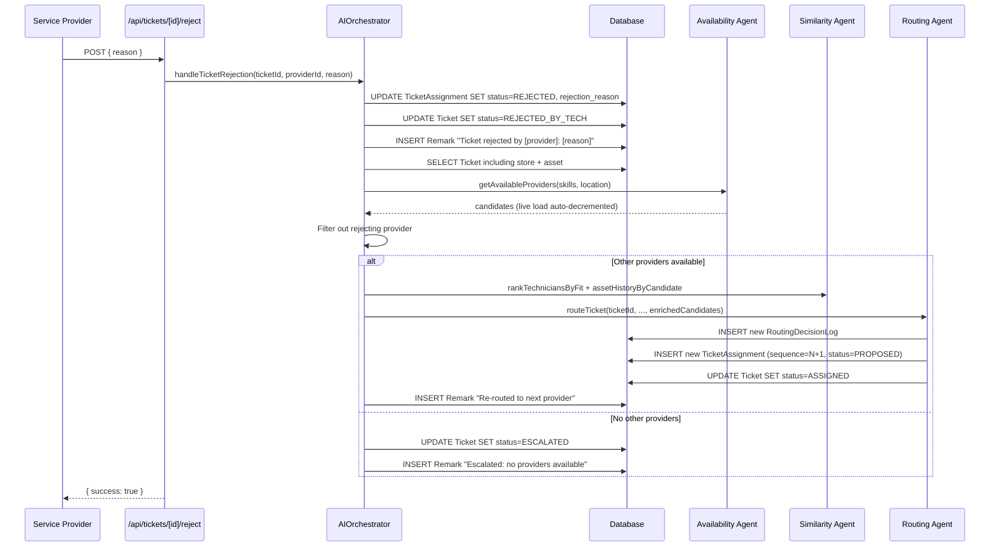

# Chapter 4 — Scoring Engine and Assignment Logic

This chapter presents the heart of the routing system: the mathematical machinery by which a candidate service provider is selected for a ticket. Where Chapter 3 introduced the routing agent at the level of its public interface and architectural position, this chapter develops the scoring engine in mathematical detail. It begins with the exact formulation of the six-feature score, including the normalization, range, and edge-case behaviour of each individual feature. It then explains the priority-driven weight adjustment that biases the formula for urgent tickets, and the principled exploration mechanism that prevents the system's own success from becoming the obstacle to its future improvement. It develops the theory of counterfactual decision logging — why every routing decision must record the alternatives that were not chosen — and concludes with the operational machinery for rejection, reassignment, and escalation that handles the cases where the initial assignment does not lead to a successful resolution.

The chapter is more mathematically dense than its predecessors. Where Chapter 3 emphasized what each component does, this chapter emphasizes why each numerical choice was made and what it would cost the system to choose differently. Several sections include both the formula being used and the alternatives that were considered and rejected, so that the report reviewer can evaluate the design decisions on their own terms.

---

## 4.1 Six-Feature Scoring Formula

### 4.1.1 Mathematical Formulation

Let `c` denote a candidate service provider in the candidate set produced by the availability and similarity agents, and let `t` denote the ticket being routed. The routing agent computes a scalar score `S(c, t)` in the closed unit interval `[0, 1]` for each candidate, and selects either the candidate with the maximum score or one of the top three candidates with controlled randomness as described in Section 4.3. The score is a convex combination of six normalized feature values:

```
S(c, t) = w_skill × f_skill(c, t)
       + w_prox  × f_prox(c, t)
       + w_avail × f_avail(c)
       + w_sem   × f_sem(c, t)
       + w_asset × f_asset(c, t)
       + w_perf  × f_perf(c)
```

Each feature `f_*` returns a value in `[0, 1]`, and the weights `w_*` are non-negative real numbers that sum to one. The convexity of the combination guarantees that `S(c, t)` itself lies in `[0, 1]`, which has two important consequences. First, scores are directly comparable across candidates (the candidate with the larger score is the one the policy prefers). Second, scores are directly comparable across tickets and across time, which is essential for retrospective analysis: the score distribution can be tracked as a time series to detect drift, and the score gap between the chosen and second-place candidates can be used as a confidence proxy.

The default weight vector — that is, the weights applied to tickets of `MEDIUM` or `LOW` priority — is shown in Table 4.1.

| Feature | Symbol | Default Weight | Cold-Start Default Value |
|---|---|---|---|
| Skill Match | `w_skill` | 0.30 | computed (always available) |
| Proximity | `w_prox` | 0.20 | computed (always available) |
| Availability | `w_avail` | 0.15 | computed (always available) |
| Semantic Similarity | `w_sem` | 0.15 | 0 (until embeddings populate) |
| Asset History | `w_asset` | 0.10 | 0 (until rated history accumulates) |
| Performance | `w_perf` | 0.10 | 0.5 (for new providers) |

**Table 4.1 — The default weight vector and cold-start defaults for the six-feature score.** The first three features are always available; the remaining three depend on data that accumulates over time. Their default values (zero or 0.5) are chosen so that the scoring formula remains well-defined and operational from the very first ticket the system processes.

The weights were chosen by domain reasoning rather than by data. They reflect the operational priorities of a maintenance-dispatch system: skill match is the single most important factor and receives the largest share; proximity follows because dispatch time directly affects resolution time; availability and semantic similarity are tied at fifteen percent each because they capture orthogonal aspects of fit; asset history and performance are weighted lower because their cold-start behaviour during the data-accumulation phase would otherwise introduce too much noise. These weights are fixed in the current implementation but are explicitly marked as the targets of replacement by a learned ranker once sufficient training data has accumulated, as discussed in Chapter 5.

### 4.1.2 Skill-Match Feature `f_skill`

The skill-match feature is a per-skill weighted overlap between the candidate's skill array and the skills required for the ticket's classified category and subcategory. For each `(category, subcategory)` pair, the routing agent's `getCategorySkills` method returns a list of `(skill_name, weight)` tuples; the weights within a category are not constrained to sum to one and are chosen to reflect the relative importance of each skill to that category. For example, the entry for `Facilities/Cold Storage` is:

```
[("Refrigeration", 0.8), ("HVAC", 0.6), ("Electrical", 0.4)]
```

The interpretation is that refrigeration expertise is the most important skill for a cold-storage failure, HVAC expertise is somewhat less important but still relevant, and electrical expertise is useful but not central. The feature's value for a candidate `c` and ticket `t` is then:

```
f_skill(c, t) = (Σ over matched skills: weight) / (Σ over all required skills: weight)
```

where a candidate's skill is considered a match for a required skill if either string contains the other, case-insensitively. This bidirectional substring matching is intentionally permissive: it accepts both `"Refrigeration"` matched against `"Industrial Refrigeration"` and `"HVAC Repair"` matched against `"HVAC"`. The looseness has produced no observed false positives in development data because the skill vocabulary is small and the strings are short.

**Figure 4.1 — Per-skill weighting for the cold-storage example** *(to be rendered as a horizontal bar chart)*. The figure should show three bars labeled `Refrigeration`, `HVAC`, and `Electrical` with widths proportional to their weights (0.8, 0.6, 0.4). Below each bar, an indicator shows whether a candidate matches that skill. The figure should make visually explicit that a candidate matching only `Refrigeration` scores 0.8 / 1.8 ≈ 0.44, while a candidate matching all three scores 1.8 / 1.8 = 1.0, demonstrating that the weighting captures gradations of fit that a simple boolean would miss.

The choice of per-skill weights versus uniform weights deserves comment. A naive implementation might score each candidate as `(matched_count / required_count)`, which would treat all skills as equally important. The system explicitly rejects this approach because in practice the skills required for a category are not equally relevant: a ticket about a freezer compressor genuinely benefits more from refrigeration expertise than from electrical expertise, even though both are listed as relevant. The per-skill weights make this hierarchy explicit in the feature and inspectable in the code.

### 4.1.3 Proximity Feature `f_prox`

The proximity feature is a normalized inverse of the geographic distance between the store and the candidate's primary location. The distance itself is computed by the Haversine formula, which approximates the great-circle distance between two points on a sphere of radius `R = 6371 km`:

```
d(p1, p2) = 2R · arcsin(√(sin²(Δφ/2) + cos(φ1) · cos(φ2) · sin²(Δλ/2)))
```

where `φ1, φ2` are the latitudes and `λ1, λ2` are the longitudes of the two points in radians, and `Δφ, Δλ` are their respective differences. The Haversine formula is accurate to within approximately 0.5 percent for distances of a few hundred kilometres, which is well within the precision required for routing decisions.

The raw distance in kilometres is then transformed into a unit-interval score via a piecewise-linear cap:

```
f_prox(c, t) = max(0, 1 − d(store, candidate) / 50 km)
```

The fifty-kilometre cap reflects the practical observation that, beyond fifty kilometres, marginal differences in distance no longer materially affect dispatch decisions: a candidate one hundred kilometres away is functionally equivalent to a candidate two hundred kilometres away from the perspective of routing, because both are likely to be chosen only when no closer candidate exists. The choice of fifty kilometres is somewhat arbitrary and has been calibrated to the geographic spread of the production data; it is configurable as a constant in the routing agent code and could be adjusted in light of operational experience.

A subtle property of the formula is that it does not penalize zero distance: a candidate located at the same coordinates as the store receives `f_prox = 1.0`, the maximum. This is consistent with the operational reality that on-site or in-store technicians (rare but possible in some store layouts) are ideal candidates and should not be artificially down-weighted.

### 4.1.4 Availability Feature `f_avail`

The availability feature reflects the candidate's remaining capacity for the day. It is computed as:

```
f_avail(c) = 1 − live_load(c) / capacity_per_day(c)
```

The numerator `live_load(c)` is the count of currently active assignments for the candidate, derived in real time from a grouped count query against the `TicketAssignment` table as described in Chapter 3, Section 3.3.3. The denominator `capacity_per_day(c)` is the candidate's daily capacity, stored as an integer column on the `ServiceProvider` table.

The feature is undefined when `capacity_per_day = 0`; the implementation treats this case by maxing the denominator at one to prevent a division by zero, but in practice no provider in the system has a zero capacity. The feature is also strictly less than one for any provider with at least one active assignment, even if their capacity is high; this is a deliberate property because even small loads represent commitments that constrain the candidate's ability to take on additional work in the same time window.

The availability filter applied earlier by the availability agent guarantees that any candidate reaching the routing agent has `live_load < capacity_per_day`, so `f_avail` is always strictly positive. It approaches zero as the candidate fills toward capacity, and it equals one only for an idle candidate with no active assignments.

### 4.1.5 Semantic Similarity Feature `f_sem`

The semantic similarity feature is the cosine similarity between the ticket's text embedding and the candidate's accumulated skill embedding, mapped from its native range of `[−1, 1]` into `[0, 1]` by clipping at zero:

```
f_sem(c, t) = max(0, cos(emb_ticket(t), emb_skill(c)))
```

The cosine similarity is computed by the similarity agent via a `pgvector` query and is returned to the orchestrator by `rankTechniciansByFit` as described in Chapter 3, Section 3.5.3. The orchestrator's enrichment helper takes the maximum similarity across all technicians belonging to a given provider as the provider's value of `f_sem`.

The clipping at zero is conservative: negative cosine similarities (which arise when the embedding vectors point in significantly different directions) are treated as equivalent to zero similarity rather than as evidence of explicit dissimilarity. The reason is that the bge-small embedding space is not metric in any operational sense — a negative cosine between a ticket about a freezer and a technician's profile does not necessarily mean the technician is bad at fixing freezers; it might simply mean their resolution notes have not yet accumulated enough data to position them meaningfully in the embedding space. Treating negative similarities as zero rather than as a penalty avoids over-interpreting a noisy signal.

The feature defaults to zero when the candidate has no associated technicians with non-null skill embeddings, which is the case for every candidate during the cold-start period and for newly-onboarded providers throughout the system's lifetime. This zero default is consistent with the broader graceful-degradation principle: features without data simply do not contribute to the score until they do.

### 4.1.6 Asset-History Feature `f_asset`

The asset-history feature reflects the candidate's track record on the specific asset associated with the ticket, or on assets of the same make and model when fleet-matching is possible. The feature value is the fraction of past tickets on matching assets that the candidate resolved with a `GOOD` moderator verdict:

```
f_asset(c, t) = good_outcomes(c, asset_set(t)) / total_outcomes(c, asset_set(t))
```

where `asset_set(t)` is the set of assets matching the ticket's asset by either exact identity or shared make-and-model. Computation of this feature is described in Chapter 3, Section 3.5.4.

The feature has explicit cold-start behaviour: when the candidate has no historical outcomes on matching assets, the formula is undefined (zero divided by zero), and the implementation returns zero. This is a deliberate choice rather than, for example, returning 0.5 as a neutral default. The reasoning is that asset-history is a strong positive signal when present (a candidate who has fixed this exact freezer ten times before is genuinely a strong candidate) and an absence of data should not be conflated with mediocre performance. Defaulting to zero allows the deterministic features to carry candidates without history, while letting candidates with strong history rise above them as data accumulates.

The feature also implements a fleet-match expansion: if the asset has both a `make` and a `model` field populated, the historical query is expanded to all assets sharing the same make and model. This captures the operational reality that experience with one freezer of a given model transfers, at least partially, to other freezers of the same model. The expansion is gated on both fields being populated to avoid spuriously matching across model boundaries when the data is incomplete.

### 4.1.7 Performance Feature `f_perf`

The performance feature is the candidate's historical fraction of completed tickets across all categories:

```
f_perf(c) = completed_tickets(c) / total_assigned_tickets(c)
```

For a candidate with no assignment history (a newly onboarded provider), the formula is zero divided by zero and the implementation returns 0.5 as a neutral default. The choice of 0.5 rather than zero or one for new providers reflects an explicit design tension: a new provider has no track record of either success or failure, and treating their absence of data as either evidence is unjustified. A neutral default lets new providers compete on their other features (skill match, proximity, availability) without being either advantaged or disadvantaged by their newness.

The feature is the weakest of the six in its current form. It captures only the binary completion-versus-non-completion signal; a ticket marked `COMPLETED` by the technician but later marked `BAD` by the moderator counts as a completion in this feature, which is incorrect from the perspective of routing quality. A future evolution would replace this binary signal with a verdict-aware ratio (`good_verdicts / total_assignments`), but doing so requires sufficient verification data to avoid penalizing providers whose tickets have not yet been verified. The current implementation is a documented compromise pending data accumulation.

### 4.1.8 Composite Score Properties

The six features combine via the convex combination introduced at the start of this section. Three properties of the composite are worth making explicit, as they shape the system's downstream behaviour.

First, the score is interpretable. Because each feature is in `[0, 1]` and the weights sum to one, a candidate's score can be read directly as a weighted average of normalized fit values. A score of 0.7 means that the candidate scores well on a weighted majority of the features; a score of 0.3 means the opposite. This interpretability has proven valuable during debugging, when administrators inspect routing decisions through the explainer-agent's output and the decision-log row.

Second, the score is comparable. The unit-interval bound makes scores comparable across candidates within a single decision (the larger score is the preferred candidate), across decisions for different tickets (a 0.7 score for one ticket means the same level of fit as a 0.7 score for another ticket), and across time (the system's mean score over a week is a meaningful operational metric).

Third, the score is monotonic in each feature. Holding the other five features fixed, increasing any single feature's value increases the composite score, because all six weights are non-negative. This monotonicity is the foundation of the priority-driven weight adjustment described in the next section: changing the weights changes how strongly the composite responds to each feature, but never reverses the direction of any feature's influence.

---

## 4.2 Priority-Driven Weight Adjustment

### 4.2.1 The Operational Thesis

The default weight vector in Table 4.1 is calibrated for typical maintenance work, where the cost of waiting an extra hour for a more-qualified technician is balanced against the benefit of better skill match. This calibration breaks down for urgent tickets. When a freezer in a grocery store fails on a Saturday afternoon, the cost of waiting is dominated by spoilage, customer disruption, and store-level operational impact; the benefit of waiting for a perfectly-matched specialist is small in comparison. The priority-driven weight adjustment encodes this thesis numerically.

The classification agent labels each ticket with a priority value of `HIGH`, `MEDIUM`, or `LOW`. The routing agent then applies an adjustment to the default weight vector for `HIGH` priority tickets only; `MEDIUM` and `LOW` tickets use the default vector unchanged. The decision to adjust only at the high end of the priority scale, rather than to specify three separate weight vectors, reflects a deliberate choice: the cost asymmetry between "rapid response over fit" and "fit over rapid response" is most pronounced at the urgent end, while the difference between medium and low priorities is operationally small enough that a single weight vector serves both adequately.

### 4.2.2 The Adjustment

For `HIGH` priority tickets, the weights are shifted as follows:

```
w_prox  ← 0.20 + 0.10 = 0.30
w_avail ← 0.15 + 0.10 = 0.25
w_skill ← 0.30 − 0.05 = 0.25
w_sem   ← 0.15 − 0.10 = 0.05
w_asset ← 0.10 − 0.05 = 0.05
w_perf  ← 0.10  (unchanged)
```

The adjustment shifts twenty percentage points of weight from the "fit" features (skill match, semantic similarity, asset history) to the "fast arrival" features (proximity, availability). The total still sums to one, preserving the comparability of scores across priority levels.

The shifts are not uniform across the donor and recipient features. Proximity and availability each gain ten percentage points, reflecting that both directly contribute to dispatch speed. The donor features lose unequal amounts: semantic similarity loses ten points (the largest reduction, because its operational benefit at the cold-start stage of the system is minimal), skill match loses five points (a smaller reduction because skill match remains operationally important even for urgent work), and asset history loses five points. Performance is left unchanged at ten percent, reflecting that historical completion rate is approximately equally relevant under all priority levels.

**Figure 4.2 — Default vs. HIGH-priority weight allocation** *(to be rendered as a stacked horizontal bar chart with two bars)*. The figure should show two horizontal bars, both of length one, divided into six segments labeled with the six features. The upper bar represents the default weights and the lower bar represents the HIGH-priority weights. The figure should use distinct colors for each feature and include annotations showing the percentage-point change for each feature (e.g., "+10pp" on proximity, "−10pp" on semantic similarity). The figure makes the adjustment visually inspectable and demonstrates that the total weight is preserved.

### 4.2.3 A Worked Example

Consider a candidate with the following feature values for a hypothetical freezer-failure ticket:

```
f_skill = 0.6   (matches Refrigeration but not HVAC or Electrical)
f_prox  = 0.9   (5 km away)
f_avail = 0.8   (one assignment of capacity ten)
f_sem   = 0.0   (no semantic data yet — cold start)
f_asset = 0.0   (no rated history on this asset yet)
f_perf  = 0.5   (new provider, neutral default)
```

Under the default weight vector, the candidate's score is:

```
S_default = 0.30 × 0.6 + 0.20 × 0.9 + 0.15 × 0.8
          + 0.15 × 0.0 + 0.10 × 0.0 + 0.10 × 0.5
        = 0.18 + 0.18 + 0.12 + 0.00 + 0.00 + 0.05
        = 0.53
```

Under the HIGH-priority weight vector, the same candidate's score is:

```
S_high = 0.25 × 0.6 + 0.30 × 0.9 + 0.25 × 0.8
       + 0.05 × 0.0 + 0.05 × 0.0 + 0.10 × 0.5
     = 0.15 + 0.27 + 0.20 + 0.00 + 0.00 + 0.05
     = 0.67
```

The same candidate scores fourteen points higher under the HIGH-priority weights, reflecting that their proximity and availability count for more under urgency. Note that the candidate's underlying feature values are unchanged; only the aggregation has shifted.

Now consider an alternative candidate with stronger skill match but weaker proximity and availability:

```
f_skill = 1.0, f_prox = 0.4, f_avail = 0.3, f_sem = 0.0, f_asset = 0.0, f_perf = 0.5
```

Under the default vector:

```
S_default = 0.30 × 1.0 + 0.20 × 0.4 + 0.15 × 0.3
          + 0 + 0 + 0.10 × 0.5
        = 0.30 + 0.08 + 0.045 + 0 + 0 + 0.05
        = 0.475
```

Under the HIGH vector:

```
S_high = 0.25 × 1.0 + 0.30 × 0.4 + 0.25 × 0.3
       + 0 + 0 + 0.10 × 0.5
     = 0.25 + 0.12 + 0.075 + 0 + 0 + 0.05
     = 0.495
```

The two candidates' relative ranking changes with priority: the first candidate (better proximity, weaker skill) outscores the second under both vectors, but the gap widens under the HIGH-priority vector (from 0.055 to 0.175), reflecting the system's preference for rapid response on urgent tickets. The example demonstrates that the adjustment is not a cosmetic re-weighting but a substantive shift in routing preferences.

### 4.2.4 Why Not Per-Category Weights

A natural extension of the priority adjustment would be to specify different weight vectors for different ticket categories: refrigeration tickets might benefit from higher skill weights, while shopping-cart tickets might benefit from higher availability weights. The current system does not do this, deliberately. The reason is that a learned ranker, once deployed, will subsume both the priority adjustment and any category-specific calibration into a single trained model that takes priority and category as features. Hand-tuning per-category weights now would create a configuration surface that the eventual learned ranker would have to either replicate or ignore, with no clear value in the interim. The priority adjustment is retained because the cost asymmetry it captures is pronounced enough to justify the immediate operational benefit, but finer-grained calibration is left to the learned ranker.

---

## 4.3 Epsilon-Greedy Exploration Mechanism

### 4.3.1 The Selection-Bias Problem

The single most consequential design decision in the routing engine is not which features to score, nor how to weight them, but whether to always select the top-scored candidate. A naive implementation that always picks the maximum-score candidate — a so-called greedy policy — has an operational property that becomes destructive when the system is later trained on its own data: every assignment in the historical record is an assignment to a candidate the policy already preferred. There is no observation of how a different candidate would have performed on the same ticket, because the different candidate was never chosen.

This phenomenon is known in the recommender-systems literature as selection bias, and it is one of the most well-documented failure modes of production learning systems. A model trained on data from a greedy policy converges to imitate the policy that produced its training data; it does not learn what makes a good outcome distinct from a bad outcome, because it has not been shown any examples where an alternative candidate was tried and the outcome compared. Over time, a greedy-trained model amplifies the original policy's biases rather than correcting them, because it has no signal that the original policy was ever wrong.

The system addresses this problem by introducing controlled randomness into the selection step. Specifically, the routing agent implements an ε-greedy policy: with probability `ε`, the agent abandons the greedy choice and instead samples uniformly from the top-three candidates. The parameter `ε` is set to 0.10 by default and is configurable via the `ROUTING_EXPLORATION_RATE` environment variable.

### 4.3.2 The Multi-Armed Bandit Framing

The exploration problem can be formalized as a contextual multi-armed bandit. The "context" is the ticket and its features; the "arms" are the candidate service providers; the "reward" is the eventual outcome (a `GOOD` moderator verdict, a fast resolution, or a combination of these). At each round, the policy must choose an arm based on the context, observe a reward, and update its understanding of which arms are good for which contexts.

The fundamental tension in any bandit problem is between exploitation — selecting the arm that current evidence suggests is best — and exploration — selecting alternative arms to gather evidence about their performance. A purely exploitative policy gathers no new evidence and therefore cannot improve. A purely exploratory policy gathers evidence efficiently but pays a steady cost in suboptimal selections. The optimal balance lies between the two, and the exact location of the optimum depends on how often the underlying reward distribution changes (a stationary problem allows less exploration than a non-stationary one) and how costly suboptimal selections are.

The ε-greedy policy is the simplest non-trivial bandit algorithm that addresses this trade-off. It exploits with probability `1 − ε` and explores with probability `ε`. The system uses ε-greedy rather than more sophisticated algorithms (such as Upper Confidence Bound or Thompson Sampling) for three reasons. First, ε-greedy is straightforward to implement and audit, with a single tunable parameter. Second, the system has not yet entered the regime where the more sophisticated algorithms would meaningfully outperform ε-greedy: those algorithms require maintaining per-arm confidence estimates, which is meaningless before any reward data has been collected. Third, ε-greedy degrades gracefully into the future: a learned ranker can be inserted into the same exploration framework simply by replacing the score-computation step, without changing the exploration logic.

### 4.3.3 The Algorithm

Let `C = [c_1, c_2, ..., c_n]` denote the candidate set sorted descending by score. The exploration step is a two-stage Bernoulli-then-uniform decision:

```
draw r ~ Uniform(0, 1)
if r < ε and n ≥ 2:
    explore = true
    chosen = uniform sample from C[0:min(3, n)]
else:
    explore = false
    chosen = C[0]
```

The first stage is a Bernoulli trial: with probability `ε`, the policy decides to explore. The second stage, conditional on having decided to explore, is a uniform sample from the top three candidates (or all candidates, if there are fewer than three). The chosen candidate is annotated with `was_exploration = true` if the exploration branch was taken, and this flag is persisted on both the `RoutingDecisionLog` and the `TicketAssignment` rows.

**Figure 4.3 — The ε-greedy algorithm as a decision tree** *(to be rendered as a tree diagram)*. The figure should show a root node "Compute scores", branching to a Bernoulli decision node "r ~ U(0,1)". The branch labeled `r < ε` leads to a sub-decision "Top-K selection" with three options corresponding to candidates 1, 2, and 3, each chosen with probability 1/3. The branch labeled `r ≥ ε` leads directly to the top candidate. The figure should include probability annotations at each branch and a summary box at the bottom showing that the overall probability of selecting the top candidate is `(1 − ε) + ε/3 ≈ 0.933` for ε = 0.10, while each of the second and third candidates is selected with probability `ε/3 ≈ 0.033`.

### 4.3.4 Why Top Three

The choice to sample from the top three candidates rather than from the full candidate list, or from the top two or top five, reflects a calibration of the trade-off between exploration and operational cost. Sampling from a wider set increases the diversity of explored candidates but also increases the average drop in score relative to the greedy choice. Sampling from a narrower set produces less diverse exploration and risks repeatedly exploring the same near-top candidates, which provides less new information.

The top-three choice has two pragmatic motivations. First, the top three candidates are typically clustered in score (a typical candidate set has scores like 0.71, 0.68, 0.65, 0.55, 0.40, ...), so exploring among them costs at most a few points of score relative to the greedy choice. Second, three candidates is the smallest sample size that provides meaningful diversity: sampling from the top two would amount to flipping a biased coin between two near-equivalent options, which is operationally indistinguishable from greedy selection in many cases.

A future evolution could replace the fixed top-three with an adaptive top-K based on the score distribution — for instance, sampling from all candidates within ten percent of the maximum score. This is left as a refinement once the data accumulated under top-three sampling has been analyzed.

### 4.3.5 Why ε = 0.10

The value of `ε = 0.10` was chosen by reasoning about the time required to accumulate counterfactual evidence relative to the operational cost of the exploration. At an exploration rate of ten percent, a system processing fifty tickets per week generates approximately five exploration assignments per week, which over six months produces approximately one hundred and thirty exploration data points. This is enough to begin observing whether the second- or third-ranked candidates outperform the top-ranked candidate on specific subpopulations of tickets, while keeping the operational cost of exploration to roughly five percent of total dispatch quality (since exploration choices are, on average, drawn from the top three and therefore not far from the greedy choice).

A higher rate, such as `ε = 0.30`, would accumulate counterfactual evidence faster but at materially higher operational cost. A lower rate, such as `ε = 0.02`, would minimize cost but might fail to accumulate enough evidence to support a useful learned ranker within an operationally relevant timeframe. Ten percent is a defensible balance, and the rate is exposed as an environment variable so that operators can adjust it as the system's needs evolve. In particular, once a learned ranker is deployed and validated, the exploration rate may be reduced: the cost-benefit calculation shifts when the model has higher quality, and continued exploration's marginal benefit diminishes.

### 4.3.6 Trade-offs and Alternatives Considered

Three alternatives to ε-greedy were considered during design.

The first was Thompson Sampling, in which each candidate is selected with probability proportional to the model's posterior belief that it is the best candidate. This algorithm has strong theoretical regret guarantees and tends to outperform ε-greedy in practice, but it requires the model to express posterior uncertainty over each candidate, which is not naturally available from the deterministic score formula in use. Adopting Thompson Sampling would require introducing a Bayesian or bootstrapped scoring step, which is significant engineering for limited current benefit.

The second was the Upper Confidence Bound algorithm, which selects the candidate with the highest score plus an exploration bonus that decays as the candidate is selected more times. UCB also requires per-candidate uncertainty estimates, with the additional complication that the "score" must be calibrated against the "confidence bonus" on a comparable scale. The system's score is a unit-interval value combining six features; converting this into a comparable confidence interval is non-trivial and would require extensive calibration work.

The third was no exploration at all, with the assumption that the eventual learned ranker would be trained on outcome data from a different policy (for instance, by running an A/B experiment in which a fraction of tickets are routed by random selection to gather counterfactual data). This approach was rejected because it postpones the learning problem to a future phase: at the moment when the system has accumulated enough verified outcomes to train a model, the data would be entirely from the greedy policy and therefore biased. By introducing exploration from the first ticket, the system ensures that the training data is unbiased by construction.

---

## 4.4 Counterfactual Decision Logging

### 4.4.1 The Off-Policy Learning Problem

The exploration mechanism described in the previous section ensures that the routing policy occasionally selects non-greedy candidates. To convert this exploration into useful training data, the system must record not only the candidate that was chosen but also the candidates that were considered and not chosen. This is the purpose of the `RoutingDecisionLog` table.

The technical framing is off-policy learning: the system aims to train a model to evaluate every candidate, including those the current policy did not select, using only data collected under the current policy. The standard tool for off-policy learning is the inverse propensity score weighting estimator, which corrects for the policy's selection bias by reweighting observations by the inverse of the probability that the policy would have selected them. To compute these weights, the trainer needs two pieces of information for each historical decision: the set of candidates that were considered, and the probability that each candidate would have been selected under the policy.

The decision log captures the first piece directly (the top-five candidates with their feature breakdowns) and the second indirectly (the chosen candidate and the exploration flag, from which the selection probability can be reconstructed: `(1 − ε) + ε/3` for the top candidate when explored, `ε/3` for each of the second and third candidates when explored, and the closed-form probability when not explored). With these two pieces, the future learned ranker can train using inverse-propensity-weighted pairwise loss, in which each candidate's outcome is weighted by the inverse probability of selection.

### 4.4.2 The Schema

The `RoutingDecisionLog` table stores one row per routing decision. Its columns are:

| Column | Type | Purpose |
|---|---|---|
| `id` | `String` | Primary key |
| `ticket_id` | `String` | Foreign key to the ticket |
| `picked_provider_id` | `String?` | The chosen service provider (null if user-targeted) |
| `picked_user_id` | `String?` | The chosen user (null if provider-targeted) |
| `was_exploration` | `Boolean` | Whether the choice was an exploration sample |
| `candidates` | `JSON` | Top-five candidates with full feature breakdowns |
| `feature_vector` | `JSON?` | Ticket-level features (category, priority, store location) |
| `created_at` | `DateTime` | Timestamp of the decision |

The `candidates` column is JSON-typed because its structure evolves as the feature set evolves, and a strictly-typed schema would require a migration for every feature addition. Each entry in the array contains a `provider_id`, a `score` value, and a `breakdown` object with the six per-feature values that contributed to the score.

### 4.4.3 The Top-Five Cap

The decision log captures only the top-five candidates rather than the full candidate list. This cap is a storage-cost trade-off. In typical operation, the candidate list contains between five and twenty providers; storing the full list would multiply the log table's size proportionally without providing equivalent analytical value, since candidates beyond the top five are rarely competitive and their feature breakdowns are most useful as upper-bound diagnostics rather than as training signal.

The top-five cap also bounds the per-row JSON column size to a predictable maximum, which keeps queries against the log table efficient. At one row per ticket and five candidates per row, with each candidate taking approximately three hundred bytes of JSON, the log accumulates at approximately 1.5 kilobytes per ticket — roughly fifty megabytes per year at fifty tickets per week. This is well within the storage budget of the PostgreSQL instance.

### 4.4.4 Training Data Construction

When the system has accumulated sufficient verified outcomes, the trainer constructs training data by joining four tables: `RoutingDecisionLog`, `TicketAssignment`, `TicketOutcome`, and `TicketRating`. Each row of training data corresponds to one (decision, candidate) pair: the candidate's feature vector at decision time, the policy's selection probability, the candidate's outcome (observed only for the candidate that was actually selected), and the label derived from the moderator verdict.

Figure 4.4 illustrates the join structure.



**Figure 4.4 — Training-data construction from four-table join.** The exporter (see `lib/ai/training/exporter.ts`) joins the routing decision log with assignment, outcome, and rating tables to produce one training row per (decision, candidate) pair. Only the chosen candidate's outcome is observed; the unchosen candidates contribute their feature vectors to the training row but are labeled `null` and serve as counterfactual context for inverse-propensity-weighted pairwise ranking.

The exporter writes the training data as JSONL — one JSON line per (decision, candidate) row — for direct consumption by the Python training script. The label is derived from the moderator verdict: a `GOOD` verdict on the chosen candidate produces a label of one, a `BAD` verdict or no verdict produces a label of zero. Unchosen candidates have a label of `null`, indicating that their outcome is not observed but their feature vector is recorded for use in pairwise ranking objectives.

### 4.4.5 Selection Bias Prevention in Practice

The combination of ε-greedy exploration and full counterfactual logging produces training data that satisfies the conditions required for unbiased off-policy estimation. Specifically, the policy's selection probabilities are positive for the top-three candidates of every decision (greedy selection gives the top candidate probability `1 − 2ε/3 ≈ 0.93`, while exploration gives the second and third candidates probability `ε/3 ≈ 0.03` each), which means that no candidate is systematically excluded from the data. This is the mathematical content of the principle described informally in Section 4.3.1: every candidate has a non-zero probability of being observed, and inverse-propensity weighting can correct for the differences in observation probability.

The choice to explore among the top three rather than across the full candidate list does limit the candidates that benefit from this guarantee: candidates ranked fourth or worse by the policy are never selected and therefore never observed. This is an acknowledged limitation of the current design. The mitigation is twofold: first, candidates ranked outside the top three are unlikely to be the genuine best choice anyway (the score formula's six features are reasonably correlated with operational quality, so the bottom of the candidate list is genuinely lower-quality), and second, the policy's preferences shift over time as candidates' performance and skill embeddings evolve, so a candidate ranked tenth today may rank in the top three tomorrow under different circumstances. Over time, exploration cycles through a substantial fraction of the candidate population.

### 4.4.6 Auditability

A secondary but operationally important benefit of the decision log is auditability. Because every routing decision is recorded with its full feature breakdown, an administrator can answer the question "why did this ticket go to this provider?" directly by querying the log. The explainer agent's output, written to the assignment row, provides a natural-language rationale; the decision log provides the underlying numerical evidence.

This auditability has proven valuable in three contexts. First, when a service provider disputes an assignment ("why did I get this ticket when company X is closer?"), the log allows the administrator to show the exact feature values that produced the decision. Second, when an outcome is unexpectedly bad, the log allows the team to retrospectively analyze whether the routing was reasonable given the information available at the time. Third, when new features are added to the score formula, the log allows the team to retroactively re-score historical decisions under the new formula and observe how the new feature would have changed the selections — a form of offline evaluation that does not require collecting new data.

---

## 4.5 Rejection, Reassignment, and Escalation

### 4.5.1 The Operational Need

The routing engine produces an assignment, but that assignment is not the end of the system's responsibility for the ticket. The chosen service provider may decline the assignment, may fail to respond within the configured timeout, or may accept and then fail to resolve the ticket within the SLA deadline. The system must handle each of these failure modes gracefully, both to ensure the ticket reaches resolution and to preserve the integrity of the data that drives future routing decisions.

This section describes the three operational pathways for a ticket that does not progress smoothly from assignment to resolution: rejection by the chosen provider, reassignment to an alternative candidate, and escalation to management when no further candidates are available. Together, these pathways ensure that the system is robust to the failure of any individual routing decision, and that every failure event is recorded as data for future learning.

### 4.5.2 The Rejection Pathway

When a service provider receives a `PROPOSED` assignment, they have three options: accept it, reject it with a reason, or allow the assignment to expire by not responding within the configured timeout window. Acceptance transitions the assignment to `ACCEPTED` and the ticket to `IN_PROGRESS`, after which the resolution flow described in Chapter 3 takes over. Rejection and expiration both invoke the rejection pathway, which is implemented in the orchestrator's `handleTicketRejection` method.

The rejection pathway proceeds in five stages, illustrated in Figure 4.5.



**Figure 4.5 — The rejection and reassignment sequence.** The diagram shows the orchestrator marking the rejected assignment, fetching the candidate set fresh (with the rejecting provider's load auto-decremented), filtering out the rejector, and re-invoking the routing pipeline. The conditional branch at the bottom shows the two outcomes: successful re-route, or escalation when no candidates remain.

In the first stage, the orchestrator updates the `TicketAssignment` row to set its status to `REJECTED`, records the rejection reason, and sets `rejected_at` to the current time. This update has a side effect on the live-load query introduced in Chapter 3: the rejecting provider's load count is automatically decremented because the rejected assignment no longer matches the `status IN ('PROPOSED', 'ACCEPTED')` filter. This is a consequence of the live-load design and demonstrates one of its operational advantages — no manual coordination is required to keep the load count accurate.

In the second stage, the ticket is updated to `REJECTED_BY_TECH` and a system-authored `Remark` is inserted to make the rejection visible to the store register. This remark is rendered in the ticket detail UI so that the store knows why their ticket has not yet been resolved.

In the third stage, the orchestrator retrieves the ticket along with its store (for location coordinates) and asset (for asset-history scoring), and invokes the availability agent fresh. The new candidate set may differ from the original set in two respects: providers whose load has changed since the original routing decision will have different availability scores, and any provider that has been deactivated or whose status has changed will be absent. The rejecting provider is then filtered out of the result by an explicit identity comparison.

In the fourth stage, the filtered candidate list is enriched by the similarity agent and passed to the routing agent, exactly as it was during the original assignment. The routing agent applies its standard six-feature scoring with priority adjustments and exploration, producing a new assignment. The new `TicketAssignment` row carries an `assignment_sequence` value of `N + 1` where `N` was the sequence number of the rejected assignment, allowing the historical chain of attempts to be reconstructed by sorting on this column. The ticket transitions back to `ASSIGNED`, and a system remark records the re-route.

In the fifth stage, if the filtered candidate list is empty (no providers other than the rejector are available), the ticket is escalated. This is described in Section 4.5.4.

### 4.5.3 Reassignment as a Learning Signal

A subtle but important property of the rejection pathway is that the original `RoutingDecisionLog` row for the rejected assignment remains in the database. When the routing agent re-routes the ticket, it writes a new `RoutingDecisionLog` row for the new decision, but does not delete or modify the original. The original record is then available as evidence, during future training, that the heuristic's top-ranked choice on that ticket was rejected. This is not the same as a `BAD` moderator verdict — rejection is a different signal than poor execution — but it is nonetheless useful evidence about routing quality.

The training pipeline can incorporate this signal by joining `RoutingDecisionLog` to `TicketAssignment` and treating rejected assignments as a distinct outcome class. A future learned ranker can then learn, for instance, that providers in a particular skill category and geographic region tend to reject certain ticket types, and adjust its scoring accordingly. This kind of signal is exactly the thing that a deterministic hand-coded scorer cannot easily capture but a learned model can.

### 4.5.4 The Escalation Pathway

The escalation pathway activates in two distinct circumstances. The first is the case described above: a rejection or expiration leaves the system with no further candidates to consider. In this case, the ticket is transitioned directly to status `ESCALATED` by the orchestrator, with a system-authored remark explaining the reason.

The second circumstance is an SLA breach detected by the escalation agent. This agent is implemented in `lib/ai/agents/escalation-agent.ts` as a LangGraph state machine that runs as a periodic batch over open tickets. It checks three SLA thresholds per ticket: an assignment timeout (the ticket has been `OPEN` for too long without an assignment), an acceptance timeout (the ticket has been `ASSIGNED` for too long without acceptance), and a resolution timeout (the ticket has been `IN_PROGRESS` past its computed `sla_deadline`). When any of these thresholds is breached, the agent inserts an `Escalation` row recording the trigger event and the responsible user, and may transition the ticket to `ESCALATED`.

**Figure 4.6 — The escalation triggers and SLA timeline** *(to be rendered as a horizontal timeline figure)*. The figure should show a horizontal time axis with markers at four points: ticket creation, the assignment-timeout threshold, the acceptance-timeout threshold, and the resolution-timeout threshold (which depends on the ticket's priority: 4h for HIGH, 12h for MEDIUM, 48h for LOW). Above the timeline, three rectangles indicate the periods during which each SLA threshold applies. Below the timeline, an arrow points to the resolution-timeout threshold and is labeled "If breached: Ticket → ESCALATED, Escalation row inserted". The figure should make explicit that the three thresholds are sequential and that a ticket can breach only one of them at a time, depending on which lifecycle stage it is in when the breach occurs.

### 4.5.5 The SLA Computation

The resolution timeout is the most operationally significant of the three SLA thresholds because it is the one that directly affects whether the ticket is resolved within the time the customer was promised. The escalation agent computes the resolution deadline at ticket creation time from the priority field of the classification result:

```
sla_deadline = created_at + sla_window(priority)
```

where the SLA window is four hours for `HIGH`, twelve hours for `MEDIUM`, and forty-eight hours for `LOW`. These windows are stored as constants in the escalation agent and reflect the operational policies of the organization deploying the system. They could be adjusted to per-store or per-category values in a future evolution, but the current design treats them as global constants for simplicity.

The deadline is persisted to the `Ticket.sla_deadline` column at creation time and is not subsequently modified, even if the ticket is rejected and reassigned. This is a deliberate choice: the SLA is a commitment to the customer, not to the dispatched provider, and a reassignment does not extend the time the customer is willing to wait. A ticket that has been rejected and reassigned still has the same deadline it had at creation, and the new provider is responsible for meeting it.

### 4.5.6 The Escalation Entity

An `Escalation` row records a single SLA breach event. Its fields capture the breach trigger, the moment it occurred, the user it was escalated to (typically a moderator or administrator), and any resolution notes. The entity is intentionally minimal: it serves as an audit record of which tickets have escalated and why, but does not carry separate workflow state. The follow-up actions on an escalated ticket — manual reassignment, customer communication, internal review — are tracked in the ticket's normal status field and remarks list.

The decision to record escalations as a separate entity rather than as a status flag on the ticket itself reflects a design principle: events should be recorded as event rows, not as state transitions on existing entities. A ticket can be escalated multiple times during its lifecycle (a reassigned ticket that then breaches its resolution deadline, for instance), and each escalation is a distinct event with its own circumstances. Modeling the escalation as an entity allows the full sequence of events to be reconstructed by listing the escalation rows in chronological order.

### 4.5.7 Recovery from Escalation

A ticket in `ESCALATED` status can return to active routing by manual intervention. An administrator or moderator who reviews the escalation can reassign the ticket directly (typically to a provider that was not originally in the candidate set, or to a provider that has since become available), at which point the ticket transitions back to `ASSIGNED` and the standard lifecycle resumes. The system does not currently provide an automated recovery from escalation, because escalations represent cases in which the automated system has explicitly run out of options; a human in the loop is the appropriate next step.

A future evolution might introduce a periodic re-evaluation in which escalated tickets are automatically considered for re-routing once new candidates become available (for instance, when a provider's load decreases or a new provider is approved). This is left as a refinement, conditional on operational evidence that automated re-routing of escalated tickets is more useful than the current human-in-the-loop pattern.

---

## Summary

This chapter has presented the mathematical and operational machinery of the routing engine in the depth required to evaluate its design choices. The six-feature score combines deterministic and learned signals into a unit-interval value that is interpretable, comparable, and monotonic in each feature; the per-feature normalization ensures that no feature can dominate solely through its scale, and the convex-combination structure ensures that the score remains in `[0, 1]` for any candidate. The priority-driven weight adjustment encodes a specific operational thesis — that urgent tickets benefit more from rapid response than from sophisticated matching — into a precise numerical shift of weights, with the total preserved to maintain comparability across priority levels.

The exploration mechanism is the system's defense against selection-bias poisoning. By introducing a small probability of non-greedy selection, the system ensures that the training data it accumulates is not an artifact of its own existing preferences. The decision log is the data substrate that makes off-policy learning possible: every routing decision records not only the chosen candidate but the alternatives that were considered, allowing a future learned ranker to train on what would have happened in counterfactual worlds.

The rejection, reassignment, and escalation pathways close the loop on the operational side. A rejected assignment triggers an automated re-route through the same pipeline, with the rejecting provider filtered out and the assignment sequence incremented; a candidate-exhausted re-route triggers escalation to a human, as does an SLA breach detected by the periodic escalation agent. Every transition is recorded — as remarks for store visibility, as status changes for workflow correctness, as decision-log rows for analytical depth, and as escalation rows for audit — ensuring that no event in the ticket's lifecycle is lost.

Together, these mechanisms realize the principle that runs through the entire system design: every routing decision should be correct now, instrumented for analysis later, and structured so that improvements can be deployed without re-engineering the surrounding components.

---

## Figures Summary

| # | Title | Type | Source |
|---|---|---|---|
| 4.1 | Per-skill weighting for the cold-storage example | Horizontal bar chart | descriptive callout |
| 4.2 | Default vs. HIGH-priority weight allocation | Stacked horizontal bar chart | descriptive callout |
| 4.3 | The ε-greedy algorithm as a decision tree | Tree diagram with probability annotations | descriptive callout |
| 4.4 | Training-data construction from four-table join | Mermaid flowchart | inline |
| 4.5 | The rejection and reassignment sequence | Mermaid sequence diagram | inline |
| 4.6 | The escalation triggers and SLA timeline | Horizontal timeline | descriptive callout |

The descriptive-callout figures (4.1, 4.2, 4.3, 4.6) are best produced in a dedicated diagramming tool because they require visual elements (proportional bars, probability annotations, timeline markers) that exceed Mermaid's expressive range. The inline figures (4.4, 4.5) render directly in any Mermaid-aware Markdown viewer and can be screenshot or exported to SVG for the final report.
