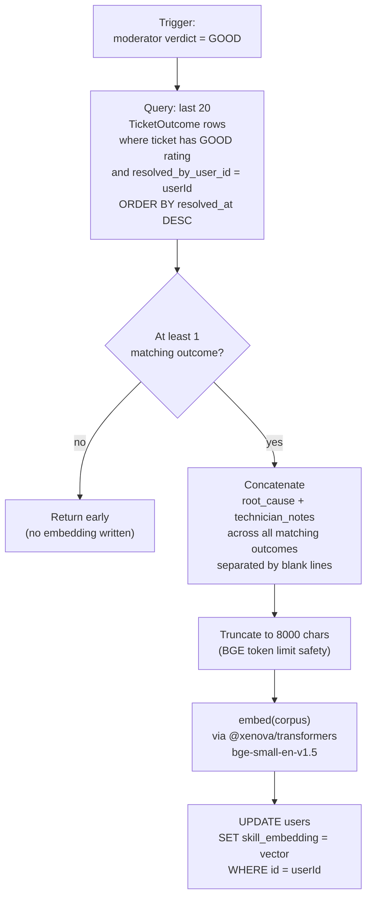
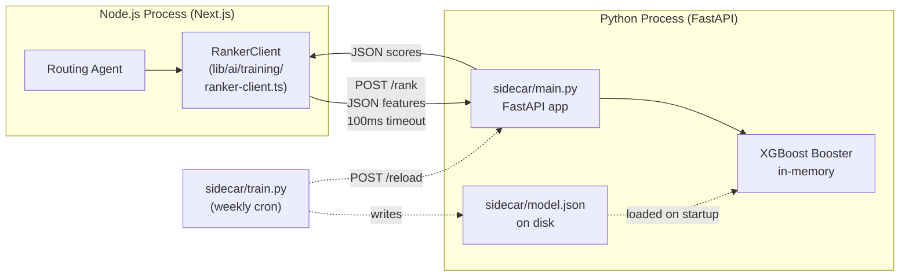
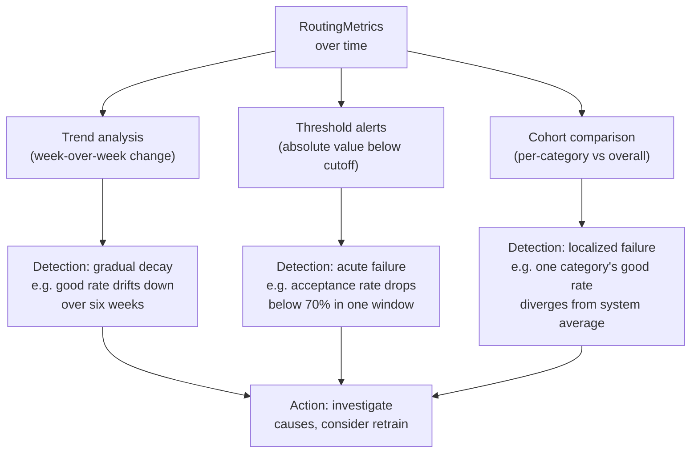

# Chapter 5 — Continuous Learning and Feedback Loop

This chapter presents the components that close the loop between the system's routing decisions and its eventual ability to improve those decisions. Chapters 2 through 4 described a system that makes intelligent routing choices using a deterministic scoring formula augmented by semantic features. This chapter describes the machinery by which the system observes the consequences of its decisions, converts those observations into structured training data, and uses that data to refine its own behaviour over time.

The chapter has a different character from those preceding it. Where Chapter 4 described mathematical machinery that runs on every ticket, this chapter describes machinery that runs at three different cadences: per-ticket (the moderator-verification loop), per-resolution (the skill-embedding refresh), per-week (the model retraining), and continuously (the drift dashboards). Some of these components are operational from the system's first ticket; others are scaffolded but inert until production data accumulates. The chapter makes both the operational state and the data-accumulation gating explicit, so that the report reviewer can distinguish between machinery that is currently running and machinery that is structurally complete but awaits data to become useful.

Two themes run through the chapter. The first is that learning systems require data, not algorithms — the system's ability to improve depends on the volume and quality of moderator verifications, not on the sophistication of the training procedure. The second is that the closed-loop architecture must be operationally correct from day one even when its learning components produce no meaningful output. Both themes inform every design choice presented below.

---

## 5.1 Moderator Verification as Ground-Truth Label

### 5.1.1 The Choice of Verifier

The single most important design decision in the continuous-learning loop is the choice of who provides the ground-truth label for whether a routing decision led to a good outcome. The system has three plausible candidates for this role: the technician who performed the work, the store register who reported the issue, and the moderator assigned to the store. The system selects the moderator, deliberately and over the alternatives, on the principle that label quality matters more than label volume.

The technician is the worst choice for self-evident reasons. A technician's verdict on their own work is not a ground-truth signal at all; it is at best an honest assessment of whether the technician thinks the work is done, and at worst a self-interested declaration that the ticket should be closed. Treating technician self-assessment as a label would systematically reward fast and superficial work over thorough resolution, because technicians who declare completion quickly would generate more "GOOD" labels than technicians who insist on verifying their work before declaring it done. The system explicitly rejects this approach: technician submission of the resolution form (`POST /api/tickets/[id]/resolve`) transitions the ticket to `COMPLETED`, but does not close it. Closure requires a separate verification step.

The store register is a better choice but still inadequate. Store registers are typically the original reporters of the ticket, and they have direct visibility into whether the problem is actually resolved. However, store registers face two systematic biases. The first is verification fatigue: a store register submitting their tenth verification of the day is unlikely to provide as careful a judgment as one submitting their first. The second is courtesy bias: store registers who interact face-to-face with technicians are reluctant to issue negative verdicts, even when the work is genuinely poor, because the social cost of a confrontation falls on the store register while the operational cost of a mediocre verdict falls on the dispatch system. Both biases tend to inflate the positive-verdict rate and suppress the signal-to-noise ratio of the labels.

The moderator is the chosen verifier because they are operationally one step removed from both the technician and the original reporter. Moderators are typically responsible for several stores and review completed tickets in batches; they have the operational distance to issue negative verdicts without social cost, and they have sufficient cross-store context to recognize patterns of poor performance that a single store register would not see. Each store has exactly one moderator, which means the labelling rate per store is bounded but the labelling consistency per moderator is high. The trade-off is volume for quality: the system collects fewer labels per ticket than it would with store-register verification, but each label is more trustworthy.

### 5.1.2 The Binary Verdict

A second design choice is the structure of the verdict itself. The system uses a binary verdict — `GOOD` or `BAD` — rather than a multi-point scale such as a five-star rating. This choice is also deliberate.

A multi-point scale offers more apparent information per verdict but in practice produces lower-quality labels. The fundamental problem is that human raters do not interpret intermediate scale values consistently: one moderator's three-star rating for a competent-but-unremarkable resolution is another moderator's four-star rating for the same work. Aggregating across moderators in a multi-point scheme requires either calibration (which adds operational complexity) or per-moderator normalization (which reduces the effective sample size). A binary scheme sidesteps these problems: every moderator must decide whether the resolution is acceptable or not, and the resulting labels are comparable across moderators without calibration.

The binary scheme also matches the downstream training objective. The eventual learned ranker is trained to score candidates by their probability of producing a good outcome, which is naturally a binary classification problem. Training a ranker on five-star labels would require either binarizing the labels (in which case the additional resolution was wasted) or using a regression objective that does not directly capture the operational question of interest. The binary verdict is a structural match for the use case.

The cost of the binary scheme is the loss of fine-grained quality distinctions. Two resolutions both labelled `GOOD` may differ substantially in their actual quality — one may be excellent and the other merely adequate — and the binary scheme cannot distinguish them. The system mitigates this loss by collecting an array of optional tags alongside the verdict, drawn from a small predefined vocabulary. The tag vocabulary differs by verdict: `GOOD` verdicts can be tagged with `fixed-fast`, `professional`, `clean-work`, or `on-time`, while `BAD` verdicts can be tagged with `not-fixed`, `had-to-call-back`, `slow`, `unprofessional`, or `damaged-property`. These tags are stored as a string array on the `TicketRating` row and provide structured secondary signal that a future training procedure can incorporate as auxiliary features.

### 5.1.3 The TicketRating Entity

The structured representation of a moderator's verdict is the `TicketRating` entity, defined in the Prisma schema as follows:

```
model TicketRating {
  id                  String         @id @default(cuid())
  ticket_id           String         @unique
  moderator_user_id   String
  verdict             RatingVerdict  // GOOD | BAD
  tags                String[]
  comment             String?
  rated_at            DateTime       @default(now())
}
```

Each ticket has at most one rating, enforced by the unique constraint on `ticket_id`. The rating records the moderator who issued it (for audit purposes), the verdict and tags as described above, an optional free-text comment, and the timestamp of the rating. The optional comment field exists for cases where the structured tags are insufficient — for instance, when a moderator wants to flag a unique circumstance that the tag vocabulary does not cover — but is not consumed by the training pipeline; it serves purely as a human-readable record.

The decision to make `TicketRating` a separate entity rather than a status flag on the ticket itself reflects the same design principle that motivated the separate `Escalation` entity in Chapter 4: events should be recorded as event rows, not as state on the entity that produced them. A rating is an event with its own timestamp, its own author, and its own structured payload, and it is most cleanly represented as a row in its own table. This also allows the rating's existence to be detected via a `LEFT JOIN` against the tickets table, which is the basis of the verification-completion-rate metric described in Section 5.4.

### 5.1.4 The BAD-Verdict Behaviour

A subtle but operationally important property of the verification flow is what happens when the moderator issues a `BAD` verdict. The intuitive expectation might be that a `BAD` verdict simply records the rating and leaves the ticket closed, on the grounds that the technician has already done their work and the moderator's verdict is purely an after-the-fact assessment. The system rejects this design and instead reopens the ticket: a `BAD` verdict transitions the ticket from `COMPLETED` back to `IN_PROGRESS`, leaving it open for re-attempt or reassignment.

The motivation for this design is that a `BAD` verdict is a substantive claim that the work is not actually done. Treating it as merely an after-the-fact rating, while leaving the ticket closed, would create a perverse incentive structure: technicians who produce poor work would face no consequence beyond a label in a dataset, and the underlying issue would remain unresolved. By reopening the ticket, the system aligns the operational and analytical incentives: poor work creates additional work, and the moderator's verdict has direct operational consequences. This in turn makes moderators more likely to issue `BAD` verdicts when warranted, because they know the verdict will produce action rather than just data.

A reopened ticket can be re-attempted by the same technician, reassigned to a different provider through the same rejection-and-reroute pathway described in Chapter 4, or escalated to a moderator for manual handling. The choice depends on operational context and is not currently automated; it falls to the moderator and store register to coordinate. The reopening is a structural mechanism that creates the option, not a fully automated workflow.

### 5.1.5 The Verification Endpoint Flow

The verification flow is implemented in `app/api/tickets/[id]/verify/route.ts` and proceeds in five steps, illustrated in Figure 5.1.

```mermaid
sequenceDiagram
    participant Mod as Moderator
    participant API as /api/tickets/[id]/verify
    participant Auth as RBAC layer
    participant DB as Database
    participant Sim as Similarity Agent

    Mod->>API: POST { verdict, tags, comment? }
    API->>Auth: requirePermission('ticket', 'verify', context)
    Auth-->>API: ok
    API->>DB: UPSERT TicketRating
    alt verdict = GOOD
        API->>DB: UPDATE Ticket SET status=CLOSED, closed_at
        API-)Sim: refreshTechnicianSkillEmbedding(resolverId)
        Note right of Sim: Fire-and-forget;<br/>response returned<br/>before refresh completes
    else verdict = BAD
        API->>DB: UPDATE Ticket SET status=IN_PROGRESS, completed_at=null
    end
    API-->>Mod: { success: true, rating }
```

**Figure 5.1 — The verification endpoint flow.** The diagram shows the endpoint's two branches. A `GOOD` verdict closes the ticket and triggers a fire-and-forget skill-embedding refresh on the resolving technician; a `BAD` verdict reopens the ticket. In both cases the rating is upserted before the ticket-status change, ensuring that the rating is never lost even if the status update subsequently fails.

The endpoint enforces authorization through the role-based access control layer's `requirePermission('ticket', 'verify')` check, which the rbac module evaluates against the moderator's relationship to the ticket's store. The rating is then upserted (rather than inserted) so that a moderator who issues an initial `GOOD` verdict and later changes their mind can revise the rating without creating a duplicate row. The status change is performed only after the rating is committed.

The fire-and-forget skill-embedding refresh on a `GOOD` verdict is the bridge to Section 5.2: a successful resolution by a technician feeds back into the technician's representation in the system's embedding space, which in turn affects future routing decisions. This is the mechanism by which the system learns from its moderator-provided labels.

### 5.1.6 The Label as Forward Signal

The moderator's verdict serves as the ground-truth label for three downstream consumers, each of which uses it differently.

The first is the routing agent's `f_perf` feature, which is described in Chapter 4 as the fraction of completed tickets but is in fact based on the verdict-aware completion rate when verdicts are available. As the system accumulates verifications, the performance feature shifts from a binary completed-versus-not signal to a verdict-weighted signal that captures actual operational quality.

The second is the similarity agent's skill-embedding refresh. Only `GOOD`-verified resolutions feed into the corpus from which a technician's skill embedding is computed. This is a deliberate filter: a technician's skill profile should reflect what they have demonstrably done well, not the full set of tickets they have attempted. A technician who has been called to twenty freezer failures but resolved only five with `GOOD` verdicts should have a skill embedding that reflects the five successful resolutions, not the full twenty. This filter is the technical content of the principle that label quality matters more than label volume.

The third consumer is the future learned ranker described in Section 5.3. The exporter that constructs training data uses the moderator verdict as the binary label for each row, with `GOOD` mapping to `1` and `BAD` (or no verdict) mapping to `0`. The verdict thus becomes the target variable that the learned ranker is trained to predict, completing the closed loop from routing decision to outcome to data to model.

---

## 5.2 Skill Embedding Refresh from Real Outcomes

### 5.2.1 The Closed-Loop Principle

The skill-embedding refresh is the most architecturally important component of the continuous-learning loop, because it is the mechanism by which the system's representation of its own technicians evolves in response to operational reality. A technician who is hired today with no track record begins with a null skill embedding. As they resolve tickets and as those resolutions are verified, their embedding is computed from the text of their actual successful resolutions. Over time, this embedding drifts in vector space toward the centroid of the kinds of work they actually do well, and the routing agent's semantic-similarity feature pulls them toward tickets that are themselves close to that centroid.

The principle is closed-loop because the system's behaviour is determined by its own observations of its own behaviour. The routing agent makes a decision; the technician resolves the ticket; the moderator verifies the resolution; the verification triggers an embedding refresh; the refreshed embedding influences the routing agent's next decision. Each iteration of this loop nudges the system's representation of the technician closer to a faithful description of what they actually do, and farther from any initial labels (such as a job title or a self-declared skill list) that may not match operational reality.

### 5.2.2 Embedding Outcomes Rather Than Declarations

A natural alternative to embedding outcomes is to embed declared skills directly: the system could ask technicians to write descriptions of their expertise, embed those descriptions, and use the resulting embedding for similarity matching. This approach is simpler, requires no waiting for outcome data, and produces embeddings on day one for newly-onboarded technicians.

The system rejects this approach in favour of outcome embedding for a specific reason: declared skills are systematically biased toward what technicians believe they are good at, which is not the same as what they are demonstrably good at. A technician with a refrigeration certification will describe themselves as a refrigeration specialist; whether they actually resolve refrigeration tickets at higher rates than other tickets is an empirical question that the declaration cannot answer. The outcome-based embedding answers it directly: the technician's embedding reflects the texts of the tickets they have actually resolved with positive verdicts, not the texts they have written about themselves.

This approach has a cost: the embedding is null for newly-onboarded technicians and remains null until they have accumulated successful resolutions. During this period, the technician contributes nothing to the semantic-similarity feature and is routed to entirely on the basis of the deterministic features. This cold-start cost is acceptable because new technicians typically start with a small share of routing volume anyway, and their declared skills can be captured in the `TechnicianSkill` table for inclusion in the deterministic skill match. The semantic-similarity feature is reserved for the genuinely earned signal of actual successful resolutions.

### 5.2.3 The Corpus Construction

When a moderator issues a `GOOD` verdict on a ticket, the verify endpoint triggers `similarityAgent.refreshTechnicianSkillEmbedding` for the resolving technician. The agent's refresh procedure, illustrated in Figure 5.2, retrieves the technician's last twenty `GOOD`-verified resolutions and constructs a corpus from their resolution texts.



**Figure 5.2 — The skill-embedding refresh procedure.** The diagram shows the five-step procedure: query the recent good outcomes, check the minimum count, concatenate the resolution texts, truncate to a safe length, embed locally, and write the resulting vector to the user's row. The procedure runs as a fire-and-forget side effect of the verify endpoint, never blocking the moderator's response.

The corpus is constructed by concatenating, for each of the twenty outcomes, the `root_cause` field followed by the `technician_notes` field, with blank lines between outcomes. The two fields are concatenated rather than stored separately because the embedding model is trained on continuous text and is not meaningfully aware of structured field boundaries; treating the two fields as a single text input produces a more coherent embedding than embedding them separately and averaging.

The lookback window of twenty outcomes is a calibration of two competing concerns. A larger window produces a more statistically stable embedding (each individual outcome contributes less to the final embedding, so anomalous outcomes have less influence) but reflects an older state of the technician's actual skills (a technician whose work has changed substantially over the past year has their current state diluted by a year-old corpus). A smaller window is more responsive to current state but more vulnerable to single-outcome noise. Twenty outcomes was chosen as a balance: at a typical resolution rate of one ticket per technician per business day, twenty outcomes covers roughly a calendar month, which is recent enough to track real changes in a technician's expertise and large enough to dampen the influence of any single outcome.

The eight-thousand-character truncation is a safety measure for the bge-small embedding model, which has a maximum input length of 512 tokens (approximately 2000 characters in English). The eight-thousand-character cap on the corpus ensures that the truncation is performed once at the corpus-construction step rather than silently at the model invocation step, where it would be harder to debug.

### 5.2.4 Why Recompute Rather Than Incrementally Update

A natural alternative to the full-recomputation approach is to maintain an incremental embedding that is updated by averaging in each new outcome's embedding rather than recomputing from scratch. This approach has two superficial advantages: it is computationally cheaper per refresh (one new outcome embedded rather than twenty) and it does not require maintaining a backward-looking corpus.

The system rejects this approach for two principled reasons. The first is that incremental averaging compounds numerical error over many updates. Each averaging step introduces small floating-point inaccuracies, and after thousands of updates the accumulated drift can produce embeddings that are detectably different from the corresponding fresh computation. This drift is invisible at any single point but is observable in a long-running system, and it is exactly the kind of bug that is difficult to diagnose retroactively.

The second reason is that incremental averaging requires a clear definition of what to average against. If the past embedding is given equal weight to the new outcome, then the contribution of any single outcome decays exponentially over time, which is not the desired behaviour. If the past embedding is decayed by a fixed factor, the system requires choosing the factor, which becomes a hyperparameter with no obvious correct value. The full-recomputation approach has a clear and explicit definition: the embedding is the centroid of the last N successful resolutions, with N a single explicit hyperparameter.

The cost of the full-recomputation approach is the per-refresh CPU time: approximately five hundred milliseconds for twenty outcomes through the bge-small model. This cost is acceptable because the refresh is fire-and-forget and runs only on `GOOD` verdicts, which occur at most a few times per technician per day. The total CPU consumption is negligible compared to the routing pipeline itself.

### 5.2.5 The Geometric Interpretation

The skill embedding lives in a 384-dimensional unit-normalized vector space. Two properties of this space are operationally relevant.

The first is that all embeddings have unit length, so cosine similarity between any two embeddings is equivalent to their dot product. This is what `pgvector` exploits internally: the distance operator `<=>` computes one minus the dot product, which for unit vectors is in the range `[0, 2]`. The routing agent's semantic-similarity feature inverts this distance back to a cosine value in `[−1, 1]` and clips at zero, as described in Chapter 4, Section 4.1.5.

The second is that the centroid of a set of unit vectors is not itself a unit vector unless all the contributing vectors happen to point in identical directions. The bge model's mean-pooling-then-normalize procedure handles this implicitly: each outcome's contribution to the corpus is mean-pooled within the model, and the final corpus-level embedding is normalized at the output. The result is that the technician's skill embedding is effectively the unit-normalized average direction of their successful resolutions in the embedding space.

This has an operational implication: a technician who has resolved tickets across multiple distinct domains (for instance, both refrigeration and POS systems) will have a skill embedding that is the average of those domain centroids, which may not be close to either domain individually. The cosine similarity between such a technician's embedding and a refrigeration-only ticket may be lower than the similarity between a pure-refrigeration specialist's embedding and the same ticket, even though the multi-domain technician is genuinely competent at refrigeration. This is a real limitation of single-vector skill representations, and a future evolution might consider per-domain embeddings or sparse representations. The current single-vector approach is acceptable as a first iteration but is acknowledged as a simplification.

### 5.2.6 The Cold-Start Trajectory

The skill-embedding refresh produces a specific cold-start trajectory for newly-onboarded technicians. In their first week, they have no embedding; the routing agent's semantic-similarity feature returns zero for them, and they are routed to entirely on deterministic features. In their second week, they have begun to accumulate `GOOD`-verified resolutions; their embedding is computed from one or two outcomes and is therefore a noisy initial estimate. By the end of their first month, they have approximately twenty resolutions in their corpus, the embedding is statistically stable, and the semantic-similarity feature begins to contribute a meaningful signal to routing decisions.

This trajectory is one example of the principle that runs through the system's design: every component degrades gracefully under the absence of its primary inputs, and the system as a whole is operationally correct from the first ticket onward even when individual learned components are inert. The deterministic features carry routing decisions during the cold-start phase; as the learned signals warm up, they augment rather than replace the deterministic features. There is no point at which the system "switches over" from deterministic to learned routing — the transition is gradual and continuous.

---

## 5.3 Training Pipeline — XGBoost Learned Ranker (Scaffold)

### 5.3.1 The Motivation for a Learned Ranker

The hand-tuned weights in Table 4.1 reflect a specific operational thesis about the relative importance of the six features. They are calibrated by domain reasoning rather than by data, and they are uniform across the entire system: every category, every store, every priority level uses the same default weights (with the exception of the priority-driven adjustment described in Section 4.2). This uniformity is a substantial limitation. The genuine optimal weights almost certainly differ across categories — refrigeration tickets may benefit from higher skill weights, while general-maintenance tickets may benefit from higher availability weights — and the uniform weights are at best a compromise across these differences.

A learned ranker is a model that produces per-candidate scores conditioned on both the candidate's features and the ticket's context. By training the model on observed outcomes, the system can learn weight allocations that are responsive to both the type of ticket and the available candidates, rather than imposing a single global weight vector. The model can also capture interactions between features that the linear scoring formula cannot represent: for instance, the interaction between proximity and priority, in which proximity matters more for high-priority tickets than for low-priority ones, is currently captured only by the discrete priority adjustment. A learned ranker can capture this interaction continuously and across other feature pairs that the hand-tuned formula does not anticipate.

The system scaffolds the learned-ranker pipeline but does not deploy a trained model in the current state. The reason is that a learned model requires sufficient training data — specifically, a sufficient number of labelled outcomes — to be trained meaningfully, and the system has not yet accumulated this data through production operation. The pipeline described below is operational from the moment training data is sufficient, but it is intentionally inert until that point.

### 5.3.2 The Choice of Algorithm

The system uses XGBoost LambdaRank as the learned-ranking algorithm. This choice was made over several alternatives, including pointwise classification with logistic regression, pairwise ranking with linear models, and neural ranking models. The choice is justified by three considerations.

The first is the size of the eventual training set. The system anticipates accumulating approximately one thousand labelled outcomes within the first six to nine months of operation, which is large enough to train a moderate-capacity gradient-boosted model but too small for a neural model of any meaningful capacity. Gradient boosting is the well-established choice for ranking problems with thousands to tens of thousands of training rows; neural models begin to outperform it only at substantially larger scales.

The second is the structure of the training data. Each training row is a (decision, candidate) pair, and the natural training objective is pairwise: within a single decision, the ranker should score the chosen candidate higher than the unchosen alternatives if the chosen candidate produced a `GOOD` verdict, and lower if it produced a `BAD` verdict. LambdaRank is the standard pairwise ranking objective for gradient-boosted models, with strong theoretical guarantees and well-understood empirical behaviour.

The third is the operational context. XGBoost is a mature, well-supported library with predictable training time, fast inference, and excellent documentation. The library's binding ecosystem includes Python (used for training in this system) and several other languages, but does not include first-class JavaScript bindings of comparable maturity. This gap motivated the architectural choice described in the next section.

### 5.3.3 The Python Sidecar Architecture

The system exposes the trained model to the Node.js routing agent via a separate Python service running FastAPI, rather than embedding the model directly in the Node application. Figure 5.3 illustrates the architecture.



**Figure 5.3 — The Python sidecar architecture.** The Node process and the Python process communicate over loopback HTTP. The Node side is responsible for feature extraction and routing-decision logic; the Python side is responsible for model storage, model inference, and model retraining. The two processes are deployed together but maintain separate binaries and dependencies.

The principal alternative considered was ONNX-in-Node: training the XGBoost model in Python, exporting it to the ONNX format, and loading it directly into the Node process via the `onnxruntime-node` library. This approach would eliminate the need for a separate Python service and reduce the inference path to in-process function calls. The system rejects this approach for two reasons.

The first reason is that XGBoost-to-ONNX conversion has rough edges in practice. The conversion handles standard numerical features cleanly but struggles with categorical features and missing-value handling, both of which are likely to be relevant in the eventual feature set. Each rough edge produces either a converted model that subtly disagrees with the original or a conversion failure that requires diagnosis. A Python sidecar avoids this entire class of problems by using XGBoost's own inference path directly.

The second reason is that the sidecar pattern enables the data team to iterate on model architecture, feature engineering, and training procedures without coordinating with the Node deployment cycle. A change to the model structure requires only a redeployment of the Python service, not a rebuild of the Node application. This separation of concerns is operationally valuable in the medium term, when model iteration is expected to be more frequent than application deployment.

The cost of the sidecar pattern is one additional process to deploy and monitor. This cost is acceptable because the Python service is small (a few hundred lines of code, two endpoints), stateless from one request to the next, and trivially horizontally scalable. The additional latency of the loopback HTTP call is approximately five milliseconds, which is negligible compared to the rest of the routing pipeline.

### 5.3.4 The Feature Builder as Single Source of Truth

The most operationally consequential design decision in the training pipeline is the use of a single feature-builder module that is consumed by both the request-time routing and the offline training. This module, implemented in `lib/ai/training/feature-builder.ts`, exposes a single function that takes the same set of inputs in both contexts and produces an identical feature vector.

The motivation is the prevention of train/serve skew, which is widely recognized as the most common silent failure mode of production machine-learning systems. Train/serve skew arises when the feature values used at training time differ in some subtle way from the feature values used at serving time — for instance, when a numeric feature is normalized differently in the two paths, or when a categorical feature is encoded with different ordinals. A model trained on one feature distribution and served on another will produce systematically incorrect scores, and the skew can be invisible in unit tests because each path is internally consistent.

The single feature-builder eliminates this class of bugs by construction. The same TypeScript function is called at request time (by the routing agent or its replacement) and at training time (by the exporter that constructs training rows from the decision log). If a feature changes — a new feature is added, an existing feature is normalized differently, an existing feature is removed — the change happens in exactly one place and is reflected in both paths simultaneously. Any other architectural pattern would introduce the possibility of drift between training and serving, with the corresponding correctness risk.

### 5.3.5 The Training Data Exporter

The training data is constructed by the exporter at `lib/ai/training/exporter.ts`, which performs the four-table join described in Chapter 4, Section 4.4.4. The exporter is invoked from a cron-callable endpoint at `/api/cron/retrain-ranker`, which is designed to be called weekly by an external scheduler. The exporter produces JSONL output — one JSON object per (decision, candidate) row — which is the input format expected by the Python training script.

The exporter is also runnable directly via `npx tsx lib/ai/training/exporter.ts`, allowing manual training-data construction for ad-hoc analysis. This is the path used during development of the pipeline: a developer can produce a JSONL file from the current state of the database, inspect its rows, and feed it to the training script without going through the cron endpoint.

A subtle property of the exporter is its handling of unchosen candidates. For each decision-log row, the exporter emits one training row per candidate (up to five rows per decision, since the log captures up to five candidates per decision). The chosen candidate's row carries a label derived from the moderator verdict; the unchosen candidates' rows carry a `null` label, indicating that their outcome is unobserved. The training script handles these unlabelled rows differently from the labelled ones: in pointwise training they are simply excluded, while in pairwise ranking they contribute their feature vectors as counterfactual contrast against the chosen candidate. This is the technical content of the off-policy learning principle described in Chapter 4, Section 4.4.

### 5.3.6 The Training Script

The Python training script is at `lib/ai/training/sidecar/train.py`. It takes a JSONL file as input, parses each row into a feature vector and label, and trains an XGBoost LambdaRank model on the resulting dataset. The script enforces a minimum data size: it refuses to train on fewer than two hundred labelled rows, on the grounds that a model trained on so little data is not statistically meaningful and would degrade routing quality if deployed. The recommended minimum is one thousand labelled rows, which the script does not enforce but which the cron endpoint reports on through its `ready_to_train` field.

After training, the script writes the model to `sidecar/model.json` (XGBoost's native serialization format) and a model version identifier to `sidecar/model_version.txt`. The version identifier is a timestamp-based string such as `v20260504-143022`, which allows the running sidecar to report which version it currently has loaded and the cron endpoint to verify that the reload succeeded.

### 5.3.7 The Inference Path and Fallback

When the learned ranker is enabled (via the `ENABLE_LEARNED_RANKER=1` environment variable and the `RANKER_SIDECAR_URL` configuration), the routing agent's score-computation step is replaced by a call to the sidecar. The Node-side client at `lib/ai/training/ranker-client.ts` constructs a feature matrix via the feature builder, sends it to the sidecar's `/rank` endpoint with a one-hundred-millisecond timeout, and returns the per-candidate scores.

The fallback behaviour is essential to the system's reliability. If the sidecar is unreachable, slow to respond, or returns an invalid response, the client throws an error and the routing agent catches the error and falls back to the deterministic six-feature score. The hundred-millisecond timeout is deliberately tight: the routing path's overall latency budget is roughly two seconds (dominated by the classification call to Gemini), and the ranker call must not consume a meaningful fraction of this budget. A sidecar that begins responding slowly is treated as effectively unavailable, and routing decisions continue under the deterministic baseline.

The fallback is not a degraded mode of operation — it is the system's mode of operation today, with the learned ranker simply absent. The routing agent's deterministic six-feature score is the production scoring formula, and it will remain so until the learned ranker has been trained, validated, and explicitly enabled. The architectural pattern is that the learned ranker, once deployed, is an enhancement layered on top of the deterministic baseline, not a replacement for it.

### 5.3.8 The Blue-Green Deployment Model

A future-deployed learned ranker requires a model-update mechanism that does not interrupt routing decisions. The system adopts a blue-green deployment pattern: the Python sidecar holds the current model in memory at startup, and the cron endpoint can trigger a hot reload by issuing `POST /reload` to the sidecar. The sidecar then loads the new model from `sidecar/model.json`, swaps it into memory, and reports success. Routing decisions made during the reload window use whichever model is currently held; there is no period during which the sidecar refuses requests.

The cron endpoint itself does not deploy unvalidated models. The training pipeline is expected to include an evaluation step (held-out validation, A/B comparison against the current model, or a similar mechanism) that decides whether the newly-trained model should replace the production model. This evaluation step is not currently implemented in the cron endpoint and is left as future work; the current cron endpoint simply exports the training data, optionally pushes it to a configured webhook, and reports on readiness. A complete implementation would include the validation logic and would either trigger or refuse the reload based on its outcome.

---

## 5.4 Drift Monitoring and Operational Metrics

### 5.4.1 Why Monitoring Is Independent of Learning

The drift-monitoring infrastructure described in this section is operational from the system's first ticket, regardless of whether a learned ranker has been deployed. This is a deliberate choice: the operational metrics that drift monitoring tracks are valuable even without any machine-learning component, because they describe the system's behaviour in dimensions that are useful for both immediate operational management and long-term trend analysis.

For instance, the rejection rate per service provider — the fraction of proposed assignments that the provider declines — is operationally useful regardless of the routing algorithm. A provider whose rejection rate exceeds a threshold is a candidate for review (perhaps their availability data is wrong, perhaps they are under-staffed, perhaps they have stopped accepting work). A category whose verified-good rate is anomalously low is a candidate for skill-map revision. Both signals are independent of any learned model and would be valuable to surface even in a system with hand-tuned scoring exclusively.

The monitoring infrastructure becomes additionally important when a learned ranker is deployed: it then serves as the early-warning system for model decay, A/B test evaluation, and retrain triggers. But the monitoring is built and operational from the beginning, not gated on the learned ranker.

### 5.4.2 The Metrics Module

The metrics module at `lib/ai/metrics.ts` exposes three top-level computations: an overall routing-metrics summary, a per-category accuracy report, and a per-provider performance report. Each is implemented as a single function that takes an optional time-window parameter (defaulting to thirty days) and produces a structured result.

The overall routing-metrics computation aggregates statistics across the configured time window. Its return type is shown below:

```ts
interface RoutingMetrics {
  window_days: number;
  total_assignments: number;
  accepted: number;
  rejected: number;
  expired: number;
  acceptance_rate: number;
  rejection_rate: number;
  total_outcomes: number;
  total_ratings: number;
  good_verdicts: number;
  good_rate: number;
  first_time_fix_rate: number;
  sla_compliance_rate: number;
  exploration_rate: number;
  ai_disagreement_rate: number;
  explanation_failure_rate: number;
}
```

Each field captures a distinct aspect of operational behaviour. The acceptance and rejection rates measure whether the routing engine's decisions are accepted in practice; the good rate measures whether the resolutions are verified as actually fixing the problem; the first-time-fix rate measures whether resolutions are completed on the first visit; the SLA compliance rate measures whether resolutions occur within the time the customer was promised; the exploration rate measures the fraction of decisions that were exploration samples; the AI disagreement rate measures the fraction of decisions where the explainer agent flagged concerns; and the explanation failure rate measures the fraction of explanation jobs that have failed.

### 5.4.3 The Per-Category Accuracy Report

The per-category accuracy computation aggregates verified-good rates by `(category, subcategory)` pair. Each row in the output reports the total number of rated tickets in that category, the count of `GOOD` verdicts, and the resulting good rate. The output is sorted by good rate ascending, so that the categories where the heuristic is performing worst appear first.

This metric is the system's most direct signal of skill-map quality. A category whose good rate is anomalously low indicates either that the skill mapping is wrong (the system is dispatching technicians whose skills do not match the actual work required) or that the ticket descriptions in that category are systematically being misclassified by the classifier (in which case the tickets that the system thinks are in the category are actually a different kind of problem entirely). Either failure mode is correctable: the skill map can be revised, the classifier can be re-prompted or supplemented with additional fallback rules, or the category itself can be split into more specific subcategories.

The per-category report is therefore the operational artifact that most directly closes the loop between observed performance and adjustable parameters. It is the report most likely to be consulted by an administrator on a weekly basis, and its structure is designed to support that workflow: the worst-performing categories appear first, the absolute counts are visible alongside the rates, and the time window is configurable so that recent performance can be inspected separately from longer-term trends.

### 5.4.4 The Per-Provider Performance Report

The per-provider performance computation produces a row per service provider with four operational metrics: the total number of tickets assigned in the time window, the number that received `GOOD` verdicts, the resulting good rate, the number of rejections, the rejection rate, and the average resolution time across resolved tickets.

This report serves several purposes. First, it is the basis for the routing agent's `f_perf` feature, which currently uses a binary completion rate but will eventually use the verdict-aware good rate. Second, it is the basis for performance-based provider review: a provider with a persistently low good rate or persistently high rejection rate is a candidate for either re-onboarding or removal. Third, it is the basis for SLA reporting to providers themselves, who may use the data to identify categories of work where their performance is below expectation.

A subtle property of this report is that it includes only providers with at least one assignment in the time window. Providers with zero assignments are simply absent. This is a deliberate choice: a zero-assignment provider has no information to report, and including them with all-zero counts would clutter the output. An administrator who wants to see provider load distribution can issue a separate query against the assignment table directly.

### 5.4.5 The Drift Dashboard Endpoint

The three metrics computations are exposed via a single API endpoint at `/api/admin/routing-metrics`. The endpoint accepts an optional `days` query parameter (clamped to the range one to three hundred sixty-five) and returns all three reports in a single response. The endpoint enforces an authorization check requiring the `ADMIN` or `MODERATOR` role.

The single-endpoint design is intentional: the three computations share the same time window and are most useful when consulted together (an administrator interpreting a low good rate in a specific category needs to see whether the providers serving that category are also performing poorly, which requires the per-provider report). Returning all three in one call ensures that they reflect the same window and that no synchronization issues arise when the administrator makes decisions based on them.

The endpoint does not currently render a UI; it returns JSON, and the consuming UI is expected to be built as part of an administrative dashboard. The decision to expose the data as a JSON endpoint rather than a server-rendered HTML page reflects two considerations: the data is naturally consumed in tabular form that benefits from a client-side rendering component, and the same endpoint can be consumed by external monitoring systems that may want to alert on threshold breaches without depending on the application's UI layer.

### 5.4.6 Drift Detection in Practice

The drift dashboard supports drift detection in three modes, each appropriate to a different operational concern. Figure 5.4 illustrates the conceptual relationships.



**Figure 5.4 — The three modes of drift detection.** Trend analysis catches gradual shifts that may indicate model decay or operational changes; threshold alerts catch acute failures that require immediate attention; cohort comparison catches localized failures in specific categories or providers. All three feed into the same investigation-and-action workflow, which may include parameter adjustment, retraining, or human review.

Trend analysis is the slowest of the three modes but the most informative. It compares the metrics in successive time windows (week-over-week, for instance) and identifies metrics that are drifting in concerning directions. A good rate that has fallen from seventy-five percent to sixty-five percent over six weeks is a stronger signal than either rate in isolation, because the drift suggests a systematic change rather than a random fluctuation.

Threshold alerts are the simplest mode and the one most amenable to automation. An administrator configures absolute cutoffs for specific metrics — for instance, "alert if the acceptance rate falls below seventy percent" — and the monitoring system raises the alert when the threshold is breached. This mode catches acute failures but misses gradual decay that stays above the cutoff.

Cohort comparison is the mode that produces the most actionable signal. By comparing the per-category report to the overall good rate, an administrator can identify specific categories whose performance diverges from the system average. A category with seventy-five percent good rate in a system whose overall good rate is sixty percent is performing well above average; one with forty percent in the same system is performing well below. Both observations are operationally meaningful and may indicate either a routing-system failure or a categorization-system failure that benefits from targeted attention.

### 5.4.7 The Connection to Retraining

The drift dashboards are also the natural input to the retraining decision. The cron-callable endpoint at `/api/cron/retrain-ranker` exports the training data and reports on its readiness, but the decision of whether to actually retrain — and whether to deploy the resulting model — depends on operational context that the dashboards provide.

A simple retraining policy might trigger a retrain whenever the number of new labelled outcomes exceeds a threshold since the last retrain. A more sophisticated policy might also consider the trend in the good rate (retrain more aggressively if the good rate is decaying), the diversity of categories represented in the new data (retrain if a previously underrepresented category has gained significant representation), and the result of any A/B tests in progress (defer retrain if an A/B test is in progress and not yet conclusive).

The current implementation does not encode any of these policies directly. The cron endpoint reports the total and labelled row counts and a `ready_to_train` flag based on a fixed threshold of one thousand labelled rows; the deployment of any newly-trained model is a manual step that an administrator performs after consulting the dashboards. This is intentional: the system is not yet at a stage where automated retraining decisions are well-calibrated, and the cost of an automated decision that deploys a worse model is substantially higher than the cost of a slightly delayed manual decision. Automation can be added as the system accumulates operational experience, but it is not a prerequisite for the learning loop to be useful.

### 5.4.8 The Future of A/B Testing

The drift-monitoring infrastructure also supports a future evolution toward A/B testing of routing policies. The `RoutingDecisionLog` already records the model version (or, currently, the absence of one), and the metrics module can in principle be extended to compute its reports stratified by model version. A complete A/B testing implementation would route a configurable fraction of tickets through a candidate model and the remainder through the production model, attribute outcomes back to the model that produced the routing decision, and compare the two cohorts on the standard metrics.

The infrastructure for this is largely in place: the decision log captures the routing context, the rating-and-outcome tables capture the labels, and the metrics module computes the rates. What is missing is the routing-time logic that selects between competing models on a stratified basis, and the metrics-time logic that disaggregates by model version. Both are straightforward extensions of the existing components and are appropriate work for the period after the first learned ranker is deployed.

---

## Summary

This chapter has presented the continuous-learning loop in four parts. The moderator-verification step provides the ground-truth label that converts operational outcomes into structured signal; the choice of moderator over technician or store register, and the choice of binary verdict over multi-point scale, are both deliberate trade-offs that prioritize label quality over label volume. The skill-embedding refresh propagates the moderator's signal back into the system's representation of its technicians, closing the loop between routing decision and routing-system knowledge. The training pipeline scaffolds a learned ranker that will eventually replace the hand-tuned weights with category-and-context-aware scoring, with explicit gating on data accumulation and a fallback path that preserves correctness when the learned model is absent or fails. The drift-monitoring infrastructure provides the operational visibility that supports both immediate management of the existing system and the eventual deployment, validation, and retraining of the learned ranker.

The four components together realize the design principle that has run through the report: the system is correct now, instrumented for analysis later, and structured so that improvements can be deployed without re-engineering the surrounding components. The moderator verification works without the embedding refresh; the embedding refresh works without the learned ranker; the learned ranker is scaffolded but inert; the drift dashboards are operational regardless. Each layer is additive, never load-bearing in a way that would create a single point of failure for the system as a whole.

The continuous-learning loop is therefore not a single deployed feature but a structural property of the system. It is built into the architecture from the schema upward and from the routing path outward, and it converts the system from a one-time-tuned dispatch engine into a system that has the explicit capacity to learn from its own operations. Whether and how quickly that capacity is realized depends on operational factors — moderator-verification rates, ticket volume, retraining cadence — that are outside the system's direct control. But the architectural commitment to learning is not contingent on those factors; it is present from the first ticket the system processes.

---

## Figures Summary

| # | Title | Type | Source |
|---|---|---|---|
| 5.1 | The verification endpoint flow | Mermaid sequence diagram | inline |
| 5.2 | The skill-embedding refresh procedure | Mermaid flowchart | inline |
| 5.3 | The Python sidecar architecture | Mermaid flowchart with subgraphs | inline |
| 5.4 | The three modes of drift detection | Mermaid flowchart | inline |

All four figures are inline Mermaid diagrams that render directly in any modern Markdown viewer. None of the chapter's figures require descriptive callouts for elaborate diagramming-tool production, because the architectural relationships in this chapter are well-suited to flowchart and sequence-diagram representations that Mermaid handles cleanly. The figures are positioned at the points where the corresponding architectural relationships are introduced, so that the reader can consult the visual representation without breaking the flow of the prose.

The four figures, considered together, tell the chapter's principal narrative: a moderator's verdict (Figure 5.1) triggers a skill-embedding refresh (Figure 5.2), which contributes data to a training pipeline (Figure 5.3), the output of which is monitored for drift (Figure 5.4) that informs the retraining decision and closes the loop. This narrative is the chapter's conceptual centre and is intentionally reflected in the figure progression.
