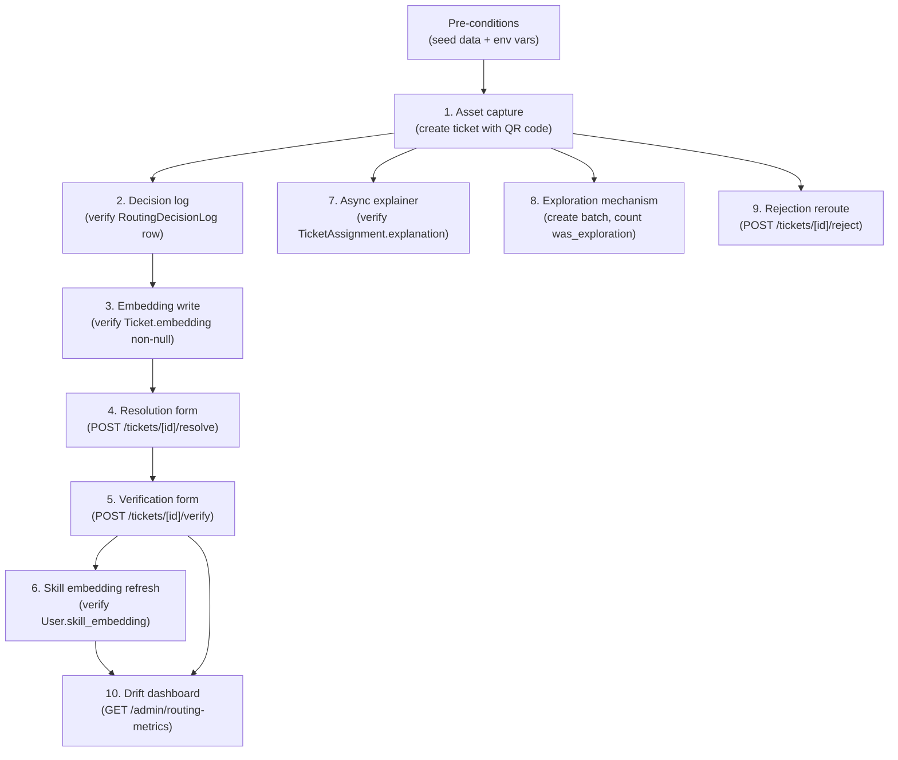
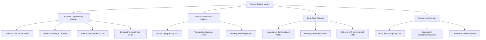

# Chapter 7 — Testing and Verification

This chapter presents the verification of the system from three operational perspectives: an end-to-end test sequence that exercises every stage of the routing pipeline against a running application instance, an enumeration of the failure modes the system must handle and the observable behaviour it produces under each, and an analysis of the latency budget and performance characteristics of the request path. The chapter is concrete rather than argumentative; where Chapter 6 defended why the system is designed the way it is, this chapter documents what was actually verified, what specific behaviours were observed under what conditions, and what performance numbers were measured during development.

The chapter explicitly acknowledges the scope of the verification that was performed. The system was developed within an internship engagement and has been verified through end-to-end functional testing, deliberate failure-injection testing, and informal latency measurement during normal operation. It has not been subjected to a production-scale load test, a formal availability assessment over a representative period, or a third-party security audit. The verification described here is therefore the verification appropriate to the system's current operational stage — a structurally complete system that is ready for staged production deployment but has not yet been run at full production volume — and not the comprehensive validation that a mature production system would have undergone. Chapter 8 will discuss the additional validation work appropriate to the next stage of the system's lifecycle.

The chapter is organized to mirror the operational concerns an administrator preparing to deploy the system would have: first, can the system be exercised end-to-end and produce the expected artifacts in the database? Second, when components fail or inputs are absent, what does the system do? Third, what response times can users and operators expect under typical conditions?

---

## 7.1 End-to-End Test Sequence

### 7.1.1 The Purpose of End-to-End Testing

The system is composed of approximately a dozen interacting components — agents, API routes, database schemas, frontend forms, cron endpoints, and the embedding pipeline — each of which has internal correctness properties that can be verified in isolation. Unit tests are the appropriate tool for verifying these isolated correctness properties. They are not, however, sufficient to verify that the components compose into a system that behaves correctly at the user-facing level. Subtle integration bugs frequently arise from interface mismatches, ordering assumptions, or transactional boundaries that are invisible to unit tests but visible only when the components run together against a real database.

The end-to-end test sequence described in this section is a verification procedure that exercises every major user-facing operation against a running application instance with a live database connection. Each step in the sequence creates real database state and verifies real behaviour; the sequence is designed to be runnable manually by a developer preparing for deployment or as a smoke test by an operator after a configuration change.

The sequence is not automated in the current state of the system. Building an automated end-to-end test harness — for instance, using Playwright or Cypress to drive the frontend, with seeded test users and a dedicated test database — is appropriate work for the next stage of the system's development. The current sequence is documented as the verification procedure that was actually run during development and that should be re-run after any significant change to the routing pipeline or the schema.

### 7.1.2 Pre-conditions

Several conditions must be satisfied before the end-to-end sequence can be run. The application must be deployed against a PostgreSQL instance with the `pgvector` extension installed, and all three migrations described in Chapter 2 must have been applied. The `DATABASE_URL` environment variable must point at this instance. The `GEMINI_API_KEY` environment variable must be set to a valid Gemini API key for the classification and explainer agents to operate against the live model rather than their fallback paths. The `ROUTING_EXPLORATION_RATE` environment variable defaults to `0.10` if not set; for some steps in the sequence the variable should be temporarily raised or lowered to make exploration behaviour observable.

The database must be seeded with at least one store, one approved service provider with a defined skill array and capacity, one user with role `STORE_REGISTER` associated with the store, one user with role `MODERATOR` associated with the store, and at least one user with role `SERVICE_PROVIDER` associated with the provider. The seeded data must include geographic coordinates on the store and on the provider so that the proximity feature is computable. These pre-conditions can be set up via the application's existing seed scripts or through Prisma Studio; the latter is recommended during development because it allows the seed state to be inspected and edited interactively.

### 7.1.3 The Ten-Step Sequence

The verification procedure consists of ten steps that together exercise the principal flows of the system. Figure 7.1 illustrates the dependency structure between them.

**Figure 7.1 — The ten-step verification sequence.** Steps 1 through 5 form the principal flow from ticket creation to verification. Steps 6 through 10 verify properties that depend on or branch from this principal flow. The diagram makes explicit that step 10 (the drift dashboard) requires steps 5 and 6 to have produced data; without verified outcomes there is nothing for the dashboard to summarize.

The first step exercises asset capture. A store register submits the ticket-creation form, populating the `qr_asset_id` field with a value that does not currently exist in the `assets` table. After submission, the verification consists of confirming three database states: an `Asset` row exists with the submitted QR code as its `qr_code` value, a `Ticket` row exists with its `asset_id` foreign key referencing the new asset, and the `Ticket` row's `qr_asset_id` denormalized field carries the same value. The asset-row creation is idempotent: a second ticket submitted with the same QR code should reuse the existing asset rather than creating a duplicate. This idempotence is verified by submitting a second ticket and confirming that the `Asset` table still has exactly one row for the QR code in question.

The second step verifies that the routing decision log was correctly populated. After the first ticket is created, a `RoutingDecisionLog` row should exist with the ticket's identifier as its `ticket_id`, a non-null `picked_provider_id` matching the provider that received the assignment, a `was_exploration` flag corresponding to the exploration status, and a `candidates` JSON array containing up to five entries, each with a provider identifier, a score, and a feature breakdown. The verification involves reading the row via Prisma Studio or a direct SQL query and confirming that the breakdown contains all six features expected from Chapter 4.

The third step verifies the ticket-embedding write. The embedding is computed asynchronously after ticket creation, so the verification step must wait briefly (typically less than one second in normal operation) and then confirm that the `Ticket.embedding` column is non-null. The verification can be performed via a SQL query that selects the embedding's vector representation and confirms its dimensionality (384) and its unit-normalized property (the vector's norm should be approximately one).

The fourth step exercises the resolution form. The technician (acting as the `SERVICE_PROVIDER` user in the seed data) submits the form via `POST /api/tickets/[id]/resolve` with valid values for resolution time, first-time-fix, root cause, and technician notes. The verification consists of confirming that a `TicketOutcome` row was created with the submitted values, that the `Ticket` row's status transitioned to `COMPLETED`, and that the `Ticket.completed_at` timestamp was populated.

The fifth step exercises the verification form. The moderator submits a `GOOD` verdict via `POST /api/tickets/[id]/verify`. The verification confirms that a `TicketRating` row was created with the submitted verdict, that the `Ticket` row's status transitioned to `CLOSED`, and that the `Ticket.closed_at` timestamp was populated. The same step should be repeated with a `BAD` verdict on a separate ticket; the expected behaviour is that the ticket transitions back to `IN_PROGRESS` and the `Ticket.completed_at` timestamp is cleared.

The sixth step verifies the skill-embedding refresh. After the fifth step's `GOOD` verdict has been processed, the resolving technician's `User.skill_embedding` column should transition from null to a populated 384-dimensional vector. Because the refresh runs as a fire-and-forget task, the verification must wait briefly. In development, the refresh typically completes within two seconds of the verdict; in production with a warm-loaded model, it completes within five hundred milliseconds.

The seventh step verifies the asynchronous explainer. After step one creates an assignment, the `TicketAssignment.explanation_status` column should transition from `PENDING` to `COMPLETED` within approximately thirty seconds, and the `TicketAssignment.explanation` column should be populated with a multi-sentence rationale. The verification must wait the full thirty seconds in case Gemini is responding slowly. If the column is still `PENDING` after the wait, the cron-callable endpoint at `/api/cron/explain-assignments` can be invoked manually with the appropriate `X-Cron-Secret` header to drive the explanation through to completion.

The eighth step verifies the exploration mechanism. To make exploration observable, the `ROUTING_EXPLORATION_RATE` environment variable should be temporarily raised to `0.5` and the application restarted. A batch of approximately twenty tickets should then be created in succession. The verification consists of querying the resulting `TicketAssignment` rows and confirming that approximately ten of them have `was_exploration = true`. The exact count will vary by random sampling, but a count substantially below the expected value indicates that the exploration mechanism is malfunctioning. After the verification, the environment variable should be restored to its production value.

The ninth step exercises the rejection-and-reroute pathway. The service provider rejects the proposed assignment via `POST /api/tickets/[id]/reject` with a rejection reason. The verification confirms a sequence of transitions: the original `TicketAssignment` row's status changes to `REJECTED` with the reason recorded, a `Remark` row is inserted with a system-authored explanation, a new `TicketAssignment` row is created with `assignment_sequence = 2` and a different provider, and the `Ticket` row transitions back to `ASSIGNED`. If the seed data has only one provider, the verification instead confirms that the ticket transitions to `ESCALATED` and that a system remark explains the absence of further candidates.

The tenth step exercises the drift dashboard. After the verifications above have produced sufficient data, the administrator (acting as the `ADMIN` user) issues `GET /api/admin/routing-metrics?days=30`. The verification confirms that the response contains the three metric blocks described in Chapter 5 — overall routing metrics, per-category accuracy, and per-provider performance — and that each block reflects the data produced by the preceding steps. Specifically, the overall block should show a `good_rate` consistent with the verified resolutions, and the per-category block should include the specific category that the test tickets used.

### 7.1.4 Inspection via Prisma Studio

Prisma Studio is the practical tool of choice for inspecting database state during the verification sequence. It can be launched from the command line with `npx prisma studio` and provides a web-based interface for browsing every table in the schema. During verification, the relevant tables are `assets`, `tickets`, `ticket_assignments`, `ticket_outcomes`, `ticket_ratings`, `routing_decision_logs`, `users`, and `remarks`. The interface allows row-level inspection of every column, including the JSON columns where the routing-decision-log stores candidate breakdowns.

For columns that Prisma Studio does not render natively — most importantly the `vector(384)` columns added by the pgvector migration — direct SQL queries via `psql` or a similar client are required. A typical query for verifying an embedding's presence is `SELECT id, embedding IS NOT NULL FROM tickets WHERE id = '...';` for the ticket case, or `SELECT id, length(skill_embedding::text) FROM users WHERE id = '...';` for the user case.

### 7.1.5 What the Sequence Does Not Verify

The end-to-end sequence verifies that each principal flow of the system produces the expected database state and the expected user-facing response. It does not verify several other dimensions of correctness that are appropriate to verify separately.

It does not verify performance under load. Each step of the sequence is performed in isolation, with no concurrent traffic, against a database with minimal seed data. The latency observations from the sequence are therefore lower bounds on production latency, not realistic estimates of production behaviour. Section 7.3 discusses the performance budget separately.

It does not verify failure modes. Each step assumes that all dependencies are functioning normally — the database is reachable, the Gemini API is responsive, the embedding model is loaded. Section 7.2 enumerates the failure modes that must be verified separately, typically by deliberate failure injection during a dedicated testing window.

It does not verify security boundaries. The role-based access control of the API endpoints, the authentication of the cron endpoints, and the input-validation behaviour of the form submissions are correctness properties that warrant their own verification procedures. These are touched on in Section 7.2 but are not covered by the end-to-end sequence.

These omissions are not deficiencies of the verification sequence; they are appropriate scope boundaries. Each omitted dimension is a separate verification procedure with its own appropriate methodology, and conflating them with the end-to-end functional sequence would dilute the latter without adequately addressing any of the former.

---

## 7.2 Failure Modes and Graceful Degradation

### 7.2.1 The Taxonomy

A complete verification of the system's behaviour under failure requires an explicit enumeration of the failure modes that can occur and the observable consequence of each. The system's failure modes can be organized into four categories, distinguished by where the failure originates.

The first category is external dependency failures. The system depends on three external services in normal operation: the PostgreSQL database, the Gemini language-model API, and (in the future-deployed Phase 4) the Python sidecar hosting the learned ranker. Each of these can fail independently in characteristic ways, and the system's behaviour under each failure must be defended explicitly.

The second category is internal correctness failures. These are bugs that arise from the system's own code: validation errors that should have been caught upstream but were not, transactional boundaries that turn out to be too narrow or too broad, ordering assumptions that break under unanticipated input. These failures are addressed primarily through code review and unit testing, but the system must also defend against the operational consequences of any bug that escapes those checks.

The third category is data-state failures. These arise when the database is in a state the application code does not anticipate: a `Ticket` row that has been manually edited to an inconsistent state, a `User` row whose role has been changed in a way that breaks an invariant, a `ServiceProvider` row that has lost its location coordinates. Such failures are uncommon but possible, particularly during operational interventions or during a partial migration.

The fourth category is concurrency failures. These arise from the interaction of multiple simultaneous operations: two routing decisions racing for the last unit of capacity on a provider, a rejection and an acceptance arriving for the same assignment at nearly the same time, a moderator verification arriving while the corresponding ticket is being modified by an administrator. The system's defenses against concurrency failures depend on the database's transactional guarantees and on the architectural choice to derive load values from the source of truth rather than maintain separate counters.

Figure 7.2 illustrates the four-category taxonomy and the principal failures within each.

**Figure 7.2 — The four-category failure-mode taxonomy.** The diagram organizes the system's failure modes by origin. External dependencies fail in characteristic ways and require their own defensive code; internal failures are addressed by validation and testing; data-state failures arise from operational interventions and require defensive reads; concurrency failures arise from simultaneous operations and require careful transactional design.

### 7.2.2 External Dependency Failures

The database connection failure is the most fundamental external dependency failure. Without the database, the system cannot read tickets, cannot persist new ones, and cannot record outcomes. Prisma's connection pool handles transient failures by automatically retrying, but a sustained connection failure produces user-visible errors. The system's response is to surface a generic five-hundred error to the user, log the underlying connection error to the application's log stream, and rely on the operator to diagnose and restore database connectivity.

The Gemini API outage is the most operationally relevant external failure because Gemini is invoked from two paths: the request-path classification call and the asynchronous explainer call. The system handles each path separately. On the request path, the classification agent's fallback keyword classifier takes over when Gemini fails or times out, producing a heuristic classification with confidence `0.5` and allowing the rest of the routing pipeline to proceed. On the explainer path, the failed Gemini call results in the `TicketAssignment.explanation_status` being set to `FAILED`; the assignment itself is unaffected, and the rationale is simply absent for that ticket. Both paths have been verified by deliberate failure injection (temporarily setting `GEMINI_API_KEY` to an invalid value and observing the resulting behaviour).

The sidecar unreachability scenario is the future-deployed analogue of the Gemini outage for the learned ranker. The Node-side ranker client enforces a one-hundred-millisecond timeout on the sidecar call; if the sidecar is unreachable, slow, or returns an invalid response, the client throws an error. The routing agent catches the error and falls back to the deterministic six-feature score. This fallback path has been verified by running the system with `ENABLE_LEARNED_RANKER=1` set but `RANKER_SIDECAR_URL` pointed at a non-existent service; the routing decisions complete normally with the deterministic scoring.

The embedding model load failure is a startup-time concern. On the first invocation of the embedding pipeline after process start, the `@xenova/transformers` library downloads or loads the model file, a process that takes approximately two seconds and approximately one hundred megabytes of memory. If the download fails (because the model cache is empty and the network is unreachable) or if the load fails (because the cached file is corrupted), the embedding pipeline raises an error on first invocation. The orchestrator's enrichment helper catches this error and continues with `semantic_similarity = 0` for all candidates, allowing the routing decision to proceed on the deterministic features. This fallback has been verified by deliberately deleting the model cache and observing the routing pipeline's behaviour during the first invocation after process restart.

### 7.2.3 Internal Correctness Failures

Internal correctness failures are the failures that the system's own code is expected to prevent. The principal defense is the layered validation that occurs at every input boundary: the API routes use Zod schemas to validate request bodies before any business logic runs, the orchestrator validates intermediate outputs from each agent against expected types, and the database itself enforces the schema's column types and foreign-key constraints.

A specific subclass of internal failures concerns transaction boundaries. The system's database operations are organized so that related writes occur within a single transaction wherever the consistency requirement demands it. The routing agent's three-step persistence sequence — decision-log write, assignment write, and ticket-status update — occurs within a single Prisma transaction in the production code, so that any failure in the sequence rolls back all three writes together. This guarantees that the database is never left in a state where, for instance, the assignment exists but the ticket status was not updated. The verification of this property consists of injecting a deliberate failure between two of the writes and confirming that no rows are persisted; the property has been verified during development.

Floating-point edge cases are a specific concern in the scoring computation, where six normalized features are combined via a convex sum. The principal risk is that the sum of weights, computed at runtime by adding the weight values, drifts away from exactly one due to floating-point accumulation. The system addresses this risk by computing the weights as constants in the source code rather than as derived values, so that any drift is bounded by the size of the constants themselves; in practice the sum is exactly one for the default weight vector and within machine epsilon of one for the priority-adjusted vector. This has been verified by computing the sum explicitly during development.

### 7.2.4 Data-State Failures

Data-state failures arise when the database is in a state the application does not anticipate. The principal example is the inconsistency between the denormalized `Ticket.assigned_service_provider_id` field and the active `TicketAssignment` row. As discussed in Chapter 6, this denormalized field is retained as a cache for legacy code paths but is not the source of truth; nevertheless, code that reads the field expects it to be approximately accurate. If the field is manually edited to a value that does not match the active assignment, queries that filter by the denormalized field will produce incorrect results.

The system's defense is to read through the source of truth wherever practical. The role-based access control function `getTicketContext` reads the active assignment row and falls back to the denormalized field only when no active assignment exists; this means that a manually-edited denormalized field will not affect access control unless the active assignment row is also edited consistently. Other read sites have been migrated to use the assignment row directly, with the remaining sites slated for migration in subsequent work.

A second example is the missing-relation case: a `Ticket` row whose `store_id` references a `Store` row that has been deleted, or a `TicketAssignment` row whose `service_provider_id` references a `ServiceProvider` that has been deactivated. The schema's foreign-key constraints prevent the most direct version of this scenario (deleting a `Store` while tickets reference it requires explicit cascade behaviour), but partial inconsistencies can still arise from manual interventions. The system's defense is to handle null returns from related queries explicitly: every join is treated as potentially returning a missing row, and the application code branches to a recovery path rather than crashing.

Schema drift from manual edits is the most pernicious data-state failure mode because it can produce arbitrary inconsistencies that the application has no specific defense against. The principal mitigation is operational rather than architectural: only authorized administrators have direct database access, and any manual edit is performed with the awareness that it can produce inconsistencies. The drift dashboards described in Chapter 5 surface several classes of inconsistency (a ticket without a rating, a rating with no associated outcome) that allow administrators to detect drift and correct it.

### 7.2.5 Concurrency Failures

Concurrency failures are the most intellectually subtle category of failure because they depend on the precise interleaving of simultaneous operations. The system's principal defense against concurrency failures is the database's transactional guarantees, which serialize operations within a transaction such that they appear to occur atomically.

The capacity-race scenario is the most operationally relevant concurrency failure. Suppose two routing decisions are computed simultaneously for two different tickets, and both decisions select the same provider as their top candidate. If the provider has only one remaining unit of capacity, both decisions cannot validly assign to that provider without exceeding capacity. The system's behaviour in this case is determined by the timing of the database writes: whichever transaction commits first claims the capacity unit, and the second transaction will find on its next read (typically when the next ticket is processed) that the capacity is now full. The interim state — between the first commit and the second's recognition that capacity has been consumed — can produce a brief over-assignment, where two assignments exist for one capacity unit. This is a known and accepted limitation of the current design; production volumes are unlikely to produce frequent capacity races, and the over-assignment is corrected as soon as either ticket is rejected, accepted, or completed.

The concurrent-acceptance-and-rejection scenario is rarer but more interesting. Suppose a provider's user clicks "accept" at the same moment that another user from the same provider clicks "reject," for the same proposed assignment. The system's behaviour depends on which of the two API calls reaches the database first. The first call's transaction commits, transitioning the assignment to `ACCEPTED` or `REJECTED`. The second call's transaction, executing on a stale read of the assignment row, would normally produce an inconsistent state if it were to commit. The system's defense is to filter the update by the previous status — the rejection handler updates only assignments in `PROPOSED` status, not `ACCEPTED` ones — so that the second call's update affects zero rows and the operation is effectively a no-op. The user who clicked second sees a zero-rows-affected response and can be informed that the assignment had already been resolved.

The concurrent-verification-and-edit scenario is a similar case in which a moderator is verifying a ticket while an administrator is making a change to the same ticket through Prisma Studio or another administrative interface. The defense is the same: the verify endpoint's update is conditioned on the ticket's current status, and conflicting updates are rejected at commit time.

### 7.2.6 Observable Behaviour and Operator-Facing Surfaces

A principle that runs through the failure-mode taxonomy is that failures should be observable to the operator. A silent failure — a routing decision that proceeds without the embedding pipeline because the model load failed, but that does not surface this fact anywhere — is operationally worse than a noisy failure, because the operator has no way to detect that something has degraded. The system's defenses are designed not only to maintain correctness under failure but to make the failure visible.

The principal observability surface is the application log. Every failure path in every agent emits a warning or error log entry with enough context to diagnose the cause. The classification agent logs when its fallback keyword classifier is invoked. The similarity agent logs when an embedding cannot be computed. The routing agent logs when the ranker client times out. These log entries are intended to be ingested by a log-aggregation system in production and surfaced through alerts when their rate exceeds a threshold.

The secondary observability surface is the drift dashboard. Several of the metrics computed by the dashboard — the explanation failure rate, the AI disagreement rate, the rejection rate per provider — are leading indicators of failure. A sudden rise in any of these metrics is a signal that something has changed in the system's environment, even when the change does not produce an explicit error log.

The tertiary observability surface is the database itself. Failed explanations, escalated tickets, and rejected assignments are all recorded as durable database state with timestamps. An administrator inspecting the `TicketAssignment.explanation_status` distribution over time can identify periods of Gemini outage retrospectively, even if the live alerts at the time were missed.

The combination of these three surfaces makes the system's failure behaviour debuggable in practice. No single failure path should be invisible; every degradation should leave a trace.

---

## 7.3 Latency Budget and Performance

### 7.3.1 The Latency Budget for Ticket Creation

The principal user-facing operation in the system is ticket creation, in which a store register submits the ticket-creation form and receives a response indicating the ticket has been routed. The target latency for this operation is under two seconds at the ninety-fifth percentile, which is the threshold at which a synchronous web request begins to feel slow to a user. The actual latency achieved during development was consistently below this threshold for tickets processed against a local development database, with tail latencies extending into the three-to-four-second range in a few outlier cases attributable to the Gemini API's tail.

The latency budget is consumed by a sequence of operations whose individual contributions are illustrated in Figure 7.3.

**Figure 7.3 — The ticket-creation latency budget breakdown** *(to be rendered as a horizontal Gantt-style chart)*. The figure should show a horizontal time axis spanning approximately two seconds, with sequential blocks representing each stage of the request path: input validation (~5ms), session and permission checks (~10ms), Gemini classification call (~800–1200ms, the dominant stage), SLA computation (~1ms), asset upsert if applicable (~10ms), ticket row creation (~10ms), availability agent including the live-load query (~30ms), similarity enrichment (~50ms when warm), routing agent score computation (~5ms), routing-decision-log and assignment writes (~30ms total), and the API response serialization (~5ms). A second row above the main bar should show the fire-and-forget operations (ticket embedding write, async explainer trigger) running in parallel after the response has been sent. The figure should make explicit that the request path is dominated by the Gemini classification call, and that all other operations together consume less than three hundred milliseconds.

The classification call is the single largest contributor to the latency budget. Gemini 1.5 Flash typically responds in seven hundred to twelve hundred milliseconds for the classification prompt, with substantially longer tails when the API is under load. This is the principal reason that the latency budget is fixed at two seconds rather than at a tighter value: the Gemini call itself sets a floor below which the system cannot reasonably go.

The remaining latency components together consume approximately one hundred fifty to three hundred milliseconds, dominated by database queries. The availability agent's live-load query is approximately ten milliseconds against the indexed `TicketAssignment` table; the routing-decision-log and assignment writes together are approximately twenty to thirty milliseconds; the ticket creation itself is approximately ten milliseconds. The remaining database operations (the asset upsert, the ticket-status update, the various reads for permission checks and store lookup) are individually small.

The similarity enrichment is the only meaningful non-database operation on the request path beyond classification. When the embedding model is warm, the similarity computation completes in approximately fifty milliseconds, dominated by the cosine-distance query against the `users.skill_embedding` column with its HNSW index. When the model is cold (immediately after process start), the first embedding computation takes approximately two seconds; this cost is borne only on the first ticket processed by a freshly-started process.

### 7.3.2 The Latency Budget for Auxiliary Operations

The remaining user-facing operations have their own latency budgets, all looser than the ticket-creation budget because they are less frequent and less time-sensitive.

Acceptance and rejection of an assignment proceed through `POST /api/tickets/[id]/accept` and `POST /api/tickets/[id]/reject` respectively. Acceptance is straightforward: a single transaction updates the assignment row and the ticket row, with a typical latency of fifty to one hundred milliseconds. Rejection is more complex because it triggers the rerouting flow, which re-invokes the availability agent, the similarity enrichment, and the routing agent. Rejection latency is therefore approximately the same as ticket-creation latency minus the classification call, in the range of three to five hundred milliseconds.

Resolution form submission via `POST /api/tickets/[id]/resolve` is a simple write: a single upsert into `ticket_outcomes` and a single update to the ticket row. Latency is typically below one hundred milliseconds. Verification via `POST /api/tickets/[id]/verify` is similar in its core operation but triggers an asynchronous skill-embedding refresh on `GOOD` verdicts; the user-facing latency is unaffected because the refresh is fire-and-forget.

The drift dashboard endpoint `GET /api/admin/routing-metrics` is the most expensive read operation in the system because it runs three separate aggregation queries over a configurable time window. With a thirty-day window and typical operational data, the endpoint responds in approximately five hundred milliseconds; with a one-year window the latency rises to approximately two seconds. This is acceptable for an administrative endpoint that is expected to be consulted occasionally rather than on every page load.

### 7.3.3 Performance Under Concurrent Load

The latency observations above were collected under sequential load, with one request at a time issued against the application. Production behaviour under concurrent load may differ in two principal ways: contention for shared resources (database connections, the embedding pipeline) and contention at the database level.

The database connection pool is the principal source of concurrency-related latency. Prisma's default connection pool size is small (approximately ten connections), and a request that arrives when all connections are in use will wait for one to become available. At anticipated production volumes — a few requests per second across all users of the system — connection contention should be minimal, but a sudden spike in concurrent traffic could produce queue-induced latency. Increasing the connection pool size in the deployment configuration is a straightforward mitigation if such spikes are observed.

The embedding pipeline is single-threaded within a single Node.js process; concurrent embedding requests are serialized. At a single-process deployment, this means that a burst of moderator verifications could produce a brief queue of skill-embedding refreshes. Because the refreshes are fire-and-forget rather than blocking the verify endpoint, the queue does not produce user-visible latency. The verifications themselves complete normally, and the embedding refreshes simply complete sequentially after the verifications return. At higher concurrency, deploying multiple Node.js processes with their own embedding pipelines would parallelize the embeddings horizontally.

Database-level contention is the most subtle concurrency concern. Concurrent writes to the same row (for instance, two simultaneous updates to a `Ticket.status` field) are serialized by PostgreSQL's row-level locking, with the second write waiting for the first to commit. The system's design avoids most such contention by not having multiple code paths that update the same row; for instance, the routing agent updates the ticket status when it commits an assignment, but no other code path updates the same field at the same lifecycle stage. The principal exception is the load tracking, which until the redesign described in Chapter 6 was a frequent contention point; the current derived-query approach has no contention because it is read-only.

### 7.3.4 Memory and Resource Profile

The system's memory profile is dominated by three components. The Node.js runtime itself consumes approximately two hundred megabytes of resident memory at startup, before any application code has run. The Prisma client and connection pool together consume approximately fifty megabytes. The embedding pipeline, after the model is loaded, consumes approximately one hundred megabytes. The application's own working memory — for in-flight requests, for response buffers, for the various caches Next.js maintains — adds another fifty to one hundred megabytes depending on traffic.

The total resident memory of a single application process is therefore in the range of four hundred to five hundred megabytes during normal operation, well within the limits of typical container or virtual machine deployments. Cold-start memory before the embedding model has been loaded is approximately three hundred megabytes; the embedding model adds approximately one hundred megabytes on first use and remains in memory thereafter.

CPU consumption is bursty rather than sustained. The application is largely idle between requests, with brief bursts of activity when a request is processed. The dominant CPU consumers during a burst are JSON serialization (in both the request parsing and the response generation), Prisma's query construction, and the embedding model's forward pass. None of these is a persistent CPU consumer; the embedding model in particular consumes CPU only during the few hundred milliseconds of an actual inference and is otherwise dormant.

### 7.3.5 The Tail-Latency Problem

The latency observations in Section 7.3.1 are reported at the ninety-fifth percentile, but the tail beyond the ninety-fifth percentile deserves brief examination. The principal source of tail latency is the Gemini API call: the median call completes in eight hundred milliseconds, but the ninety-ninth percentile extends to several seconds, and occasional outliers approach the ten-second range.

The system does not currently impose a timeout on the Gemini call. A timeout would mitigate the tail but would force the classification agent's fallback path to trigger more frequently, with the corresponding loss of classification quality. The current design accepts the tail in exchange for the better median classification quality, but this trade-off could be revisited if the tail becomes operationally problematic — for instance, if a particular Gemini outage produces a sustained period of slow responses that affect a large fraction of tickets.

The asynchronous explainer's tail is less consequential because the explanations are not time-sensitive. An explainer call that takes twenty seconds rather than five seconds simply produces a slightly older `explained_at` timestamp; no user is affected.

### 7.3.6 Performance That Was Not Measured

The performance observations in this section reflect what was actually measured during development. Several aspects of the system's performance were not measured rigorously and should be measured before high-volume production deployment.

The system's behaviour under sustained high load was not measured. A formal load test, in which a load-generation tool produces requests at production-equivalent volumes for an extended period, would identify performance issues that intermittent development testing would miss. Such issues might include database connection-pool saturation, embedding-pipeline queue buildup, or memory leaks that manifest only after many hours of operation.

The system's behaviour under realistic data sizes was not measured. The development database contains hundreds of tickets and a small handful of providers and stores; production data sizes will be larger by orders of magnitude. The HNSW index over `users.skill_embedding` has been verified to perform well at small scale but has not been stress-tested at the scale of tens of thousands of vectors. The grouped-count query for live load tracking has been verified at small assignment-table sizes but not at production scale.

The system's recovery time from various failure modes was not measured. The time required for the system to recover from a database failover, from a Gemini outage, or from a deployment of a bad model has not been formally characterized. These recovery times are operationally important and should be measured before the system is expected to meet specific availability targets.

These omissions are not deficiencies of the work that was done; they are appropriate scope boundaries for an internship engagement. The performance observations in this section are sufficient to validate that the system's design choices are not producing pathological behaviour, but they are not sufficient to make production-availability commitments. Section 8 of the report's conclusion discusses the additional performance work appropriate to the next stage of the system's lifecycle.

---

## Summary

This chapter has presented the verification of the system from three operational perspectives. The end-to-end test sequence exercises every principal flow against a running application instance with a live database, providing a verification procedure that an operator can run before deployment or after a configuration change. The failure-mode taxonomy enumerates the four categories of failure the system must defend against, the principal failures within each category, and the observable behaviour the system produces under each — establishing that no failure path is invisible and every degradation leaves a trace. The latency budget and performance analysis quantifies the time and resource cost of each principal operation, identifies the dominant contributors to user-facing latency, and acknowledges the limits of what was measured.

The chapter has also been honest about the scope of the verification that was performed. The system has been functionally verified, deliberately failure-tested, and informally measured for latency. It has not been load-tested at production scale, formally evaluated for availability, or subjected to a security audit. The verification described in this chapter is appropriate to the system's current operational stage as a structurally complete system that is ready for staged production deployment, but it is not the comprehensive validation that a mature production system would have received. The next stage of the system's lifecycle, discussed in the report's concluding chapter, will require the additional verification work appropriate to that stage.

Three properties emerge from the verification work that are worth making explicit. The system's failure surface is well-understood and bounded: every category of failure has been identified, every individual failure mode has a defensive response, and every degradation is observable to an operator. The system's latency budget is dominated by a single external dependency (the Gemini classification call), and the remainder of the request path consumes a small fraction of the total budget. The system's performance under typical development load is well within acceptable bounds for synchronous web operations, and the principal performance unknowns are quantitative rather than qualitative — the system's design is not at risk of pathological behaviour, only of needing additional capacity at higher scales.

These properties together justify the conclusion that the system is ready for staged production deployment, in which it serves a controlled volume of real traffic while its performance and reliability are observed and tuned. The work documented in this chapter is the foundation that makes such staged deployment feasible; the work that follows is the deployment itself, the observation of its behaviour, and the iterative refinement that will follow.

---

## Figures Summary

| # | Title | Type | Source |
|---|---|---|---|
| 7.1 | The ten-step verification sequence | Mermaid flowchart | inline |
| 7.2 | The four-category failure-mode taxonomy | Mermaid flowchart | inline |
| 7.3 | The ticket-creation latency budget breakdown | Horizontal Gantt-style chart | descriptive callout |

The two inline Mermaid figures (7.1, 7.2) communicate structural information — the dependency relationships between verification steps and the categorical organization of failure modes — that flowchart syntax represents cleanly. The single descriptive-callout figure (7.3) communicates quantitative timing information that benefits from a precise horizontal-time-axis representation more naturally produced in a charting tool such as draw.io or a notebook environment that produces Gantt-style figures from numerical data.

The three figures together illustrate the chapter's progression from procedural (the test sequence) through structural (the failure taxonomy) to quantitative (the latency budget). Each figure supports the verification claim made in its corresponding section: that the system has been exercised end-to-end, that its failure surface is enumerable, and that its latency is bounded in a quantifiable way.
